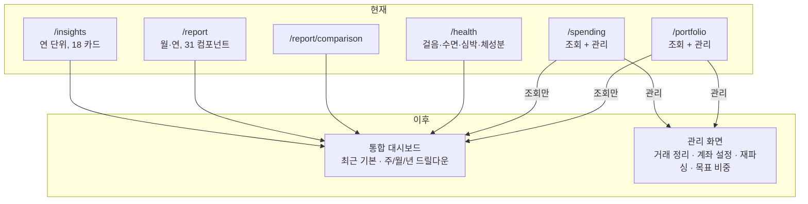

# 통합 대시보드 요구사항

## Summary

`/insights`와 `/report`를 하나로 합치고, `/health`·`/spending`·`/portfolio`의 **조회 성격 콘텐츠**까지 흡수해 단일 대시보드를 만든다. 기본 뷰는 "최근"이고 주/월/년으로 드릴다운한다. 모든 집계는 크론이 사전 계산하며 화면은 즉시 렌더링하고 "기준 시각"을 함께 표시한다. 관리 성격 기능(거래 삭제, 계좌 설정, 재파싱 등)은 기존 전용 화면에 남는다.

---

## Problem Frame

인사이트와 보고서는 같은 원천 데이터를 서로 다른 시점에 구현한 두 화면이다. 그 결과 세 가지가 동시에 나타난다.

**중복.** 히트맵, 스트릭, 장소 생산성, 지하철, 교통수단, 여행, 체성분이 양쪽에 각각 구현되어 있다. `PlaceProductivityCard.tsx`는 `src/modules/insights/components/`와 `src/modules/report/components/`에 파일 이름까지 같은 채로 두 벌 존재한다. 한쪽을 고쳐도 다른 쪽은 그대로다.

**커버리지 불균형.** 보고서 집계 서비스는 `transactions`·`holdingSnapshots`·`brokerage*` 테이블을 한 번도 참조하지 않는다 — 소비와 포트폴리오가 보고서에 통째로 빠져 있다. 반대로 인사이트 서비스는 걸음수·수면·심박을 참조하지 않는다 — Withings 체성분만 있고 나머지 건강 지표는 `/health`에만 있다. 어느 화면도 "그 기간에 내가 어떻게 살았나"를 다 담지 못한다.

**응답 속도.** 실측(개발 DB, Tailscale 경유):

| 호출 | 소요 |
|---|---|
| 인사이트 연간 배치 (16개 섹션) | 4,423ms |
| 보고서 월간 위치 (enriched) | 3,603ms |
| 보고서 연간 위치 | 8,792ms |
| 보고서 월간 커밋 | 153ms |
| 보고서 월간 코딩 | 168ms |

병목은 위치 집계에 집중되어 있다. 보고서 서비스는 246만 행짜리 `location_points` 원본을 윈도우 함수로 스캔한다(`src/modules/report/service.ts:1243-1375`). 인사이트는 원본을 건드리지 않고 파생 테이블만 쓰기 때문에 상대적으로 빠르다. 즉 느림의 원인은 페이지가 두 개인 것이 아니라 요청 시점에 원천을 집계한다는 것이며, **두 페이지를 그냥 합치기만 하면 4.4초와 3.6초가 한 화면에 더해질 뿐이다.**

여기에 세 가지 "최신이 아님"이 겹친다. AI 회고문은 어디에도 저장되지 않아(`src/app/api/reports/monthly/route.ts`는 생성 결과를 반환만 한다) 페이지를 열 때마다 항상 비어 있고, 버튼을 눌러 매번 새로 생성해야 한다. 파생 데이터는 매일 01:00 KST 크론이 전날치만 처리하므로 항상 하루 뒤처져 있다(실측: `location_points` 최신 07-21 20:53 vs `tracks` 최신 07-20 06:00). 그리고 두 화면 모두 최소 단위가 월이라 "이번 주에 뭐 했지"를 볼 곳이 없다.

---

## Key Decisions

**단일 대시보드로 통합하되 관리 기능은 흡수하지 않는다.** 대시보드는 다섯 영역(코딩·위치·건강·소비·자산)의 *보는 것*을 전부 담는다. 거래 삭제, 알림 로그 정리, 재파싱 미리보기/적용, KIS 계좌 추가·설정, 목표 비중 편집은 성격이 다른 작업이고 `/spending` 한 파일만 1,037줄이다. 이것들이 들어오면 대시보드는 다시 스크롤 지옥이 된다.

**기본 뷰는 "최근"이다.** 현재 두 화면의 최소 단위는 월(보고서)과 년(인사이트)이다. 열었을 때 새 정보가 없다는 감각의 직접적 원인이다. 기본은 최근 창(주 단위)이고 주/월/년으로 확대한다.

**집계는 사전 계산한다.** 요청 시점 집계를 유지하면 어떤 구조로 합쳐도 느리다. 크론이 기간별 집계를 미리 계산해 저장하고, 화면은 저장된 값을 읽는다. 대신 화면에 기준 시각을 명시해 "지금 이 순간"이 아님을 감춘 채로 두지 않는다. `dataUsageCache`(`src/db/schema.ts:419`, `calculatedAt` 컬럼 보유)가 이 프로젝트 안의 선례다.

**"최근" 기본 뷰는 파생 파이프라인 주기 상향을 동반한다.** 하루 1회 전날치 처리를 유지하면 기본 화면이 구조적으로 항상 어제까지만 보인다. 두 결정이 함께여야 의미가 있다.

**중복은 인사이트 쪽 구현을 기준으로 통합한다.** 인사이트가 나중에 만들어졌고 디자인 토큰(`data-neon`)과 카드 프리미티브가 정리되어 있다. 보고서 전용 콘텐츠는 그 프리미티브로 이식한다.

**AI 회고문은 저장하고 크론이 생성한다.** 지금은 생성 결과가 휘발되어 사실상 기능이 없는 것과 같다. 저장 없이 자동 생성만 붙이면 매번 API 비용이 들고, 자동 생성 없이 저장만 붙이면 여전히 처음 한 번은 기다려야 한다.

---

## 통합 대상 지도

---

## Requirements

**정보 구조**

- R1. 단일 대시보드 경로 하나가 코딩·위치·건강·소비·자산 다섯 영역의 조회 콘텐츠를 모두 담는다.
- R2. 기본 뷰는 "최근"이며, 사용자가 아무것도 선택하지 않고 열었을 때 이 뷰가 뜬다.
- R3. 기간 범위는 최근·주·월·년 네 단계로 전환할 수 있고, 선택한 범위는 URL에 반영되어 새로고침과 공유에 유지된다.
- R4. 기간 범위 전환 시 같은 카드 세트가 해당 범위 기준으로 재계산되어 표시된다. 특정 범위에서 의미가 없는 카드(예: 주 단위에서 연간 스크래치 맵)는 그 범위에서 숨긴다.
- R5. 소비·자산·건강 영역은 대시보드에 요약 형태로 들어가고, 각 전용 화면으로 이동하는 링크를 제공한다.
- R6. 기간 비교 기능(현재 `/report/comparison`)은 대시보드 안의 한 기능으로 흡수한다.

**데이터 신선도와 성능**

- R7. 대시보드가 표시하는 모든 집계는 사전 계산된 값에서 읽는다. 요청 시점에 `location_points` 같은 원천 테이블을 스캔하지 않는다.
- R8. 화면은 데이터의 기준 시각을 표시한다. 영역별 기준 시각이 다르면 각 영역에 표시한다.
- R9. 사전 계산은 크론 컨테이너에서 수행한다. 웹 컨테이너에서 실행하지 않는다.
- R10. 사전 계산이 아직 없는 기간을 사용자가 선택하면, 빈 화면 대신 계산 중임을 알리고 완료 시 표시한다.
- R11. 위치 처리 파이프라인(anomaly → visit → track → transportation → subway)의 실행 주기를 올려, "최근" 뷰가 당일 데이터를 반영할 수 있게 한다.
- R12. 사용자가 특정 기간의 집계를 수동으로 다시 계산할 수 있다.

**콘텐츠 통합**

- R13. 양쪽에 중복 구현된 개념(활동 히트맵, 스트릭, 장소 생산성, 지하철 이용, 교통수단, 여행, 체성분)은 각각 하나의 카드로 통합한다.
- R14. 보고서에만 있던 콘텐츠(언어 추이, 프로젝트 타임라인, 커밋 유형, 깊은 작업, 컨텍스트 전환, 일·시간대 버블, 스크래치 맵, 첫 방문)는 통합 대시보드에서 유지되거나 명시적으로 제거된다. 암묵적 누락은 허용하지 않는다.
- R15. 건강 영역은 체성분뿐 아니라 걸음수·수면·심박·VO2max를 포함한다.
- R16. 소비 영역은 순지출과 계정 역할 분류가 반영된 집계를 포함한다.
- R17. 자산 영역은 평가액 추이와 시간가중수익률(TWR)을 포함한다.
- R18. 카드 정리는 유지/과감히 축소/제거 세 갈래로 판정하며, 판정 결과와 근거를 계획 단계 산출물에 기록한다.

**AI 회고문**

- R19. 생성된 회고문은 (사용자, 기간 유형, 기간) 단위로 저장되고 재방문 시 즉시 표시된다.
- R20. 크론이 기간 종료 후 회고문을 자동 생성한다. 대상 기간 유형과 생성 시점은 계획 단계에서 확정한다.
- R21. 저장된 회고문을 수동으로 재생성할 수 있으며, 재생성은 기존 회고문을 대체한다.
- R22. 회고문 생성 실패가 대시보드의 나머지 렌더링을 막지 않는다.

**이관과 호환**

- R23. `/insights`, `/report`, `/report/comparison`, `/health`는 통합 대시보드의 대응 상태로 리다이렉트한다.
- R24. 헤더 내비게이션에서 인사이트·보고서·건강 항목이 통합 대시보드 단일 항목으로 대체된다.
- R25. 기간 계산은 `src/lib/utils.ts`의 로컬 날짜 헬퍼를 사용한다. 현재 `src/app/report/page.tsx:105`는 `new Date().toISOString().slice(0, 7)`로 기본 기간을 잡아 UTC 월을 쓰며, KST 00:00–09:00 구간에서 잘못된 월이 뜬다.

---

## Acceptance Examples

- AE1. **Covers R2, R8, R11.** 사용자가 대시보드를 연다. 최근 뷰가 뜨고, 오늘 오전에 기록된 커밋과 이동이 이미 반영되어 있으며, 상단에 "2026-07-22 09:00 기준"이 표시된다.
- AE2. **Covers R7, R10.** 사용자가 아직 한 번도 조회하지 않은 2023년을 선택한다. 8초 대기 대신 계산 중 상태가 즉시 표시되고, 완료되면 화면이 채워진다.
- AE3. **Covers R4.** 사용자가 "주"를 선택한다. 연간 스크래치 맵과 12개월 다이제스트는 사라지고, 나머지 카드는 그 주 기준 수치로 바뀐다.
- AE4. **Covers R19, R20.** 8월 1일에 사용자가 대시보드에서 7월을 연다. 회고문이 이미 작성되어 있고 버튼을 누를 필요가 없다.
- AE5. **Covers R22.** Anthropic API 호출이 실패한 기간을 연다. 회고문 자리에만 실패 표시가 뜨고 차트와 수치는 정상 렌더링된다.
- AE6. **Covers R5.** 사용자가 대시보드의 소비 요약에서 특정 거래를 지우고 싶다. 대시보드에는 삭제 버튼이 없고, 소비 전용 화면으로 가는 링크를 통해 이동한다.

---

## Success Criteria

- 대시보드 최초 렌더링까지의 서버 응답이 어떤 기간 범위에서도 500ms 이내. (현재 기준선: 인사이트 연간 4,423ms, 보고서 연간 위치 8,792ms)
- 요청 경로에서 `location_points` 원본 스캔 0건.
- 같은 개념을 그리는 컴포넌트가 두 모듈에 중복 존재하지 않음.
- 통합 후 대시보드가 코딩·위치·건강·소비·자산 다섯 영역을 모두 표시.
- 회고문이 있는 기간을 열었을 때 추가 클릭 없이 읽을 수 있음.
- 최근 뷰가 당일 활동을 반영함.

---

## Scope Boundaries

**범위 밖 (전용 화면에 유지)**

- 거래 삭제, 알림 로그 정리, 재파싱 미리보기·적용 (`/spending`)
- KIS 계좌 추가·설정, 목표 비중 편집 (`/portfolio`)
- OwnTracks/WakaTime/Toss 키 관리, 위치 백필, 지하철 매칭 백필 (`/settings`)
- 커밋 타임라인과 커밋 상세 (`/`)

**이번에 하지 않음**

- 집계 결과의 stale-while-revalidate 재검증. 사전 계산 + 기준 시각 표시로 먼저 검증하고, 부족하면 그때 얹는다.
- 새로운 분석 지표 추가. 이번 작업은 기존 콘텐츠의 통합과 속도이지 새 인사이트가 아니다.
- 소비·자산 관리 화면의 재설계.

---

## Dependencies / Assumptions

- 크론은 별도 컨테이너에서 실행된다. 사전 계산은 다초 단위 CPU 작업이므로 웹 컨테이너에 두면 HTTP 요청이 막힌다 — 이 프로젝트에서 이미 겪은 문제다.
- 크론 단일 인스턴스 가정에 의존하는 인메모리 가드가 존재한다. 사전 계산 잡을 추가할 때 이 가정을 깨지 않아야 한다.
- 실측 응답 시간은 Tailscale 경유 개발 DB 기준이므로 네트워크 지연이 포함되어 있다. 절대값은 운영 환경에서 더 낮겠지만 항목 간 상대 비중(위치 집계가 지배적)은 유효하다.
- 어떤 카드를 실제로 보는지에 대한 사용 로그가 없다. R18의 판정은 데이터가 아니라 사용자 판단에 의존한다.
- 대시보드는 단일 사용자 개인 앱이므로 다중 사용자 동시성·권한 분리는 고려 대상이 아니다.

---

## Outstanding Questions

**계획 전에 해결**

- 사전 계산 저장 단위. 기간 유형별(주/월/년) 스냅샷을 통째로 저장할지, 일 단위 집계를 저장하고 조회 시 합산할지. 후자는 저장 공간이 적고 임의 기간에 유연하지만 조회 시 합산 비용이 남는다.
- 사전 계산 갱신 주기. R11의 파이프라인 주기와 묶어서 결정해야 한다.
- 회고문 자동 생성 대상. 주간까지 생성하면 API 비용이 연 52회 늘어난다. 월간·연간만으로 충분한지.

**계획 단계에서 해결**

- 통합 대시보드의 경로 이름.
- R18의 카드별 유지/축소/제거 판정.
- "최근"의 기본 창 길이(7일 / 14일 / 30일).
- 기간 비교(R6)의 대시보드 내 표현 형태.

---

## Sources / Research

- `src/modules/insights/service.ts` (1,208줄) — 파생 테이블 기반 집계 18종.
- `src/modules/report/service.ts` (1,964줄) — 원천 테이블 집계. `location_points` 원본 스캔은 1243–1375행. `transactions`·`holdingSnapshots`·`brokerage*` 참조 0건.
- `src/app/api/insights/route.ts` — 단일 트랜잭션 배치 팬아웃. 커넥션 풀 고갈 대응 주석이 남아 있어 이 경로가 이미 한 번 성능 문제를 겪었음을 보여준다.
- `src/modules/report/hooks.ts` — 기간당 8개 요청 병렬 발사. 인사이트에서 이미 고친 팬아웃 패턴이 보고서에는 남아 있다.
- `src/app/api/reports/monthly/route.ts` — 회고문 생성 결과를 저장 없이 반환.
- `src/db/schema.ts:419` — `dataUsageCache`. `calculatedAt`을 가진 사전 계산 캐시의 기존 선례.
- `src/app/health/page.tsx` — 걸음·거리·운동·심박·안정시심박·VO2max·수면·SpO2·체성분·상관관계.
- `src/lib/cron.ts`, `CLAUDE.md` — 크론 스케줄(메인 10분, 위치 처리 01:00 KST 전날치, Toss 재파싱 23:00).
