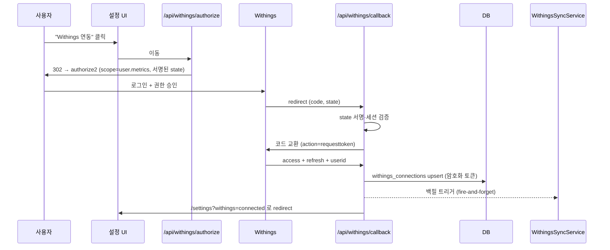
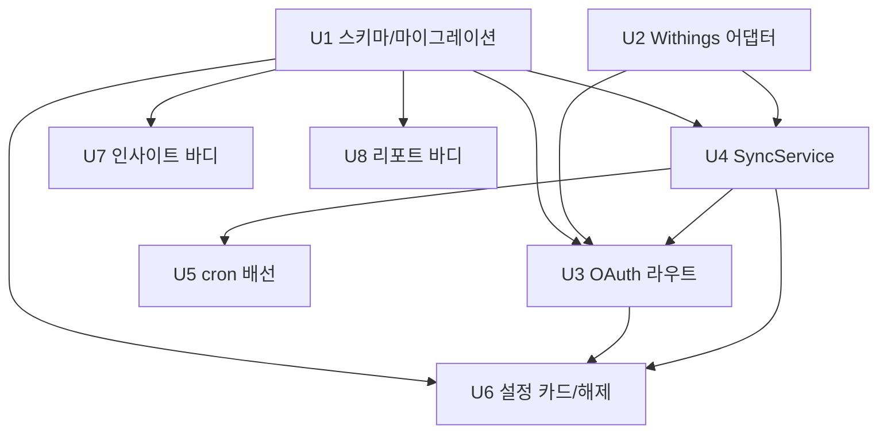

# feat: Withings Body Smart 체중계 연동

## Summary

Withings 소비자 Data API를 **직접 구현한 OAuth2 authorize/callback 라우트**로 연동하고, KIS의 암호화 토큰 + advisory-lock 갱신 패턴을 그대로 재사용해 cron이 `getmeas`를 증분 폴링·저장한다. 신규 `withings_connections`/`body_measurements` 두 테이블에 담고, 인사이트 "바디" 섹션과 월간/연간 리포트 섹션(기존 섹션 등록 패턴 확장)으로 노출한다.

---

## Problem Frame

Cistory는 삶의 기록을 한곳에 모으는 개인 라이프로깅 앱인데, 새로 구입한 Withings Body Smart 저울의 체중·체성분 데이터만 Withings 앱에 갇혀 통합 뷰에서 빠져 있다. 상세 배경은 origin 참조 — `docs/brainstorms/2026-07-10-withings-body-scale-integration-requirements.md`.

플랜 관점의 핵심 제약: Withings 토큰 엔드포인트는 **비표준**(`action=requesttoken` + `{status, body}` 래퍼)이고 refresh 토큰이 **회전형(1회용)** 이라, 표준 OAuth 플러그인으로는 깔끔히 안 맞고 토큰 저장·갱신 로직을 우리가 소유해야 한다.

---

## Requirements

- R1. 설정 페이지에서 Withings 계정을 OAuth2 인증 코드 방식으로 연동 (연동 카드 → 승인 → 콜백 → 완료).
- R2. 설정에 연동 상태 표시 + 연동 해제.
- R3. 액세스/refresh 토큰·자격증명 암호화 저장, 만료 전 자동 갱신, **회전된 refresh 토큰까지 원자적 교체 저장**.
- R4. cron이 `lastupdate` 워터마크 기반 증분 동기화.
- R5. 최초 연동 시 과거 측정값 전체 백필.
- R6. Body Smart의 모든 측정 지표 저장.
- R7. 동일 측정값 재수집 시 중복 저장 안 함 (idempotent upsert).
- R8. 측정 시각을 KST 기준으로 정규화·집계.
- R9. 인사이트에 전용 "바디" 섹션 추가.
- R10. 바디 섹션에 체중 추이 + 체성분 추이 표시.
- R11. 바디 섹션에 최근 스냅샷 + 직전 대비 변화량 표시.
- R12. 월간/연간 리포트에 바디 섹션 추가.
- R13. 동기화 실패 격리 — 한 사용자·한 블록 실패가 전체를 막지 않음.

**Origin flows:** F1 (계정 연동 OAuth), F2 (주기적 동기화)
**Origin acceptance examples:** AE1 (covers R3, 토큰 갱신), AE2 (covers R5·R7, 백필 후 중복 없음), AE3 (covers R4, 신규 없음), AE4 (covers R8, KST 경계)

---

## Scope Boundaries

- 크로스도메인 상관분석 (체중 vs 여행/지출/코딩) — 제외 (origin: 향후 과제).
- Withings 다른 기기 데이터 (수면·혈압·활동량) — 저장/UI 제외. 단 동일 `getmeas`·동일 어댑터라 확장 용이.
- 실시간 webhook(Notify) 푸시 — 제외 (폴링만). Notify는 HMAC nonce 서명이 필요하므로 폴링-only는 서명 로직도 회피.
- 목표 체중 설정/알림, 데이터 내보내기 — 제외.
- **측정 삭제 반영 제외(알려진 한계):** 폴링(`getmeas`)은 삭제를 통지하지 않음(Notify 전용). 사용자가 Withings 앱에서 오측정을 지우면 우리 DB에는 남아 최소/최대·델타를 왜곡할 수 있음 — v1 수용, 필요 시 후속(주기적 전량 재대조 또는 Notify).

### Deferred to Follow-Up Work

- `crypto.ts`의 `KIS_ENCRYPTION_KEY` → 범용 `APP_ENCRYPTION_KEY` 리네이밍 (fallback 포함). 이번엔 기존 키 재사용, 별도 정리 PR로 분리.
- Body Comp/Body Scan 상위 기기 지표(혈관나이 155·맥파속도 91)의 전용 UI. 이번엔 원시 저장만.

---

## Context & Research

### Relevant Code and Patterns

- **어댑터**: `src/lib/adapters/kis/{kis.ts,types.ts,tr-ids.ts,interface.ts}` — 토큰에 대해 stateless한 클라이언트, private `throttle()`/retry/`AbortSignal.timeout`, `KISAuthError`/`KISApiError` 에러 taxonomy. Withings 어댑터가 미러링할 형태.
- **토큰 캐시·갱신**: `src/modules/portfolio/service.ts` `getValidToken` (~L112-186) — `db.transaction` + `pg_advisory_xact_lock(hashtextextended('kis-token:'||id,0))` + **락 안에서 row 재조회** 후 갱신. Withings의 회전형 refresh에 그대로 필요 (동시 갱신 시 old refresh 무효화 방지).
- **암호화**: `src/lib/crypto.ts` `encryptSecret`/`decryptSecret` (AES-256-GCM, per-secret salt+IV, `KIS_ENCRYPTION_KEY`). 토큰 저장에 재사용.
- **cron**: `src/lib/cron.ts` per-user 루프, 블록별 try/catch 격리, portfolio 블록(~L245-284)의 24h `lastSyncedAt` 게이트 형태. Withings 블록이 미러링.
- **KST 날짜**: `src/db/sql.ts` `localDaySql` (SQL 집계), `src/lib/utils.ts` `toLocalDateString`/`parseDateLocal` (JS). `getmeas`의 epoch → KST day 변환에 사용 (AE4).
- **스키마**: `src/db/schema.ts` `brokerageAccounts`(암호화 토큰+expiry+watermark), `holdingSnapshots`(natural-key `unique` upsert-in-place, `raw_*` JSON stash). 최신 마이그레이션 `0024` → 다음 `0025`. Withings는 PostGIS 불필요.
- **인사이트 섹션 등록**: `src/app/api/insights/route.ts`(`VALID_SECTIONS` + batched `Promise.all` in `db.transaction` + `?section=` switch), `src/modules/insights/service.ts`(`InsightsService` static 메서드, 예 `getNetSpend`), `src/modules/insights/hooks.ts`(`AllInsights`/`UseInsightsReturn`), `src/modules/insights/components/NetSpendCard.tsx`(+ `primitives/InsightCard`,`Stat`), `src/app/insights/page.tsx`(`SectionDivider`).
- **리포트 섹션 등록**: `src/app/api/reports/{monthly,yearly}/route.ts`(`VALID_SECTIONS` + `if(section===...)`), `src/modules/report/service.ts`(`aggregateMonthly<X>`/`_aggregate...` + `aggregateMonthlyData` Promise.all), `src/modules/report/types.ts`, `src/modules/report/hooks.ts`(`useSectionFetch`), `src/modules/report/prompts.ts`(`buildMonthlyNarrativePrompt` 조건부 블록), `src/modules/report/components/`.
- **설정 카드**: `src/modules/settings/types.ts`(`UserSettings`), `src/app/api/settings/route.ts`(`readUserSettings`, `!!row.x` 불리언), `src/modules/settings/components/SettingsForm.tsx`(카드 마운트 + GitHub `authClient.signIn.social` 재연결 버튼 ~L50-55), `WakaTimeSettings.tsx`(props로 연결상태 수신), `src/modules/settings/hooks.ts`(`useWakaTimeKey` disconnect).

### Institutional Learnings

- 공식 `docs/solutions/`는 없음. 대신 `docs/portfolio/kis-integration.md` §7이 실측 API 함정 카탈로그: 응답 필드가 문자열로 옴, ~1s 간격에도 rate-limit, 인증 실패가 여러 에러코드로 갈림 — Withings에도 그대로 적용. **코딩 전 raw `getmeas` 스파이크로 실측 검증** 권장.
- 회전형 refresh 토큰은 KIS(client_credentials)엔 없던 **신규 표면**: 갱신 실패 시 계정을 `needs_reauth`로 표시하고 재연동을 유도해야 함.
- API가 계산해 주는 파생값을 맹신 말 것(`returns.ts` deposit 이중계상 교훈): 예로 체지방량은 저장하되, 파생 지표는 실측 대조 후 사용.
- in-memory single-flight/rate-limit는 replica 확장 시 깨짐 → 토큰 직렬화는 반드시 advisory-lock. OAuth `state`도 in-memory 금지 → 서명 기반 stateless.

### External References

- Authorize: `https://account.withings.com/oauth2_user/authorize2` (`response_type=code`, `client_id`, `scope=user.metrics`, `redirect_uri`, `state`).
- Token: `POST https://wbsapi.withings.net/v2/oauth2` (`action=requesttoken`, `grant_type=authorization_code|refresh_token`, `client_id`, `client_secret`, `code|refresh_token`, `redirect_uri`). 응답: `{status, body:{access_token, refresh_token, expires_in, scope, userid, token_type}}`.
- 액세스 토큰 3h(10800s), refresh 1년·**회전형**. old refresh는 **새 토큰 발급 후 8h 또는 새 access 최초 사용 시점까지** grace 유지.
- `getmeas`: `POST https://wbsapi.withings.net/measure` (`action=getmeas`, `meastypes`(콤마), `category=1`, `startdate`/`enddate`/`lastupdate`, `offset`). `lastupdate` 우선, 페이지네이션 `more`/`offset`, `body.updatetime`이 다음 워터마크. 값 = `value × 10^unit`.
- 측정 코드(확정): 1 Weight, 5 FatFreeMass, 6 FatRatio%, 8 FatMass, 11 HeartPulse, 76 MuscleMass, 77 Hydration, 88 BoneMass, **170 VisceralFat**(168 아님·168=세포외수분), 226 BMR, 227 MetabolicAge. 91 PWV·155 VascularAge는 **Body Smart 미지원**(Body Comp/Scan 전용) → 저장만, UI 가정 금지.
- Rate limit 120 req/min/app. status 0=성공, 601=too-many-requests(백오프), 100/101/102/200/401=인증실패(refresh-retry), 522=timeout.
- 폴링은 Withings 공식 권장(`lastupdate`). HMAC 서명은 Notify.subscribe에만 필요 → 폴링-only는 불필요.
- 앱 등록: `developer.withings.com/dashboard/create` → `client_id`/`client_secret` + Registered URL(redirect_uri) 등록. 표준 Public API는 별도 승인 게이트 없음.
- UI 프리어아트(체성분 표시): Withings Health Mate(원시점+Trend Weight 추세선, 지표별 분리 차트, index는 수치+정상범위 밴드), Apple Health(체성분 무색·중립), Fitbit/Renpho/Zepp(지표별 range 또는 composite score), WHOOP/Oura(개인 baseline 대비 편차). 공통: 체중+추이 헤드라인, 스택 컴포지션 바는 비주류. 색상 주의 근거: diet/fitness 앱 이분법 색상의 불안 유발(PMC8485346).

---

## Key Technical Decisions

- **OAuth를 직접 구현(authorize/callback 라우트)** — Better Auth `genericOAuth` 대신. 이유: Withings 토큰 엔드포인트가 비표준(`action=requesttoken`, `{status,body}` 래퍼)이라 표준 플러그인이 안 맞고, 직접 구현이 KIS 암호화 토큰 + advisory-lock 갱신 패턴을 통일되게 재사용. 앱의 Better Auth 설정(민감)도 건드리지 않음.
- **연결/데이터 2-테이블 분리** — `withings_connections`(사용자당 1행, userId unique: 암호화 access/refresh, expiry, withings userid, scope, status, `lastMeasureUpdate` 워터마크, `lastSyncedAt`, `lastSyncError`) + `body_measurements`(측정그룹당 1행). 단일 per-user 통합이지만 컬럼이 많아 `users` 컬럼 대신 전용 테이블 (KIS 스타일).
- **측정 스키마는 하이브리드(wide + raw JSON)** — 차트에 쓰는 Body Smart 지표는 타입 컬럼(`weightKg`, `fatMassKg`, `fatFreeMassKg`, `muscleMassKg`, `boneMassKg`, `hydrationKg`, `fatRatioPct`, `heartRateBpm`, `visceralFat`, `bmrKcal`, `metabolicAge`), 나머지 전부는 `rawMeasures` JSON에 무손실 저장. 순수 EAV(집계 난이도)와 순수 wide(신규 타입마다 스키마 변경) 사이 절충 — `holdingSnapshots`의 타입컬럼+`raw_*` 관례와 일치.
- **중복 방지 natural key = `(userId, withingsGroupId=grpid)`** — `onConflictDoUpdate` upsert-in-place (같은 `lastupdate` 창 재조회 시 R7/AE2).
- **회전형 refresh 처리** — `getValidToken`을 advisory-lock + 락내 재조회로 직렬화하고, 갱신 성공 시 새 access+refresh를 **같은 트랜잭션에서** 암호화 저장. 갱신이 하드 실패하면 connection.status=`needs_reauth`로 표시하고 설정 UI가 재연동 유도.
- **암호화 키는 기존 `KIS_ENCRYPTION_KEY` 재사용** — 코드 변경 0. 범용 리네이밍은 Deferred.
- **OAuth `state`는 서명 기반 stateless** — 세션 userId + nonce + 만료를 HMAC 서명(기존 crypto 활용)해 라운드트립. web 컨테이너 다중 replica에서도 안전 (in-memory 금지).
- **동기화는 cron 컨테이너에서만** — OAuth 콜백은 web 컨테이너(가벼운 토큰교환+백필 트리거만), 무거운 반복 sync는 `cron.ts` 블록.

---

## Open Questions

### Resolved During Planning

- 스키마 long/EAV vs wide → **하이브리드**(위 결정).
- OAuth 콜백 genericOAuth vs 직접 → **직접 구현**(비표준 토큰 엔드포인트).
- refresh 토큰 1회용 처리 → advisory-lock 직렬화 + 원자적 교체 + `needs_reauth`(위 결정, 8h grace가 추가 안전망).
- Visceral Fat 코드 → **170**(리서치 정정). 155/91은 Body Smart 미지원 → raw만.
- 리포트 바디 데이터의 AI 내러티브 포함 여부 → 기존 `enriched` 파라미터 조건부 블록 패턴으로 **저비용 포함**(U8, opt-in 블록).
- 바디 섹션 기본 노출 → **체성분 풀 카드**: 헤드라인 체중+체지방%, 주요 근육·뼈·수분·내장지방, 보조 스탯 BMR·대사나이·심박 (U7/U8).

### Deferred to Implementation

- 실제 Body Smart 계정의 `getmeas` 원시 응답으로 측정 코드·단위·기기 지원 지표 **실측 확인** 후 타입컬럼 확정 (U2 execution note).
- 백필 시작 시각: `startdate=0` vs connection 생성 시점 — 저울이 새 것이라 데이터가 적어 실무상 무의미하나, Withings 계정에 과거 수동입력이 있으면 `startdate=0`로 전량 수집.
- 백필 페이지네이션 스로틀 — 120 req/min은 요청당 ≥500ms이므로 KIS의 350ms는 부족. **≥500ms(여유 ~600ms)**에서 출발해 실측 조정. 120/min은 앱 전역이라 백필(web)+cron 동시 실행이 예산 공유.

---

## High-Level Technical Design

> *의도한 접근의 방향성 안내이며 구현 사양이 아님. 구현 에이전트는 맥락으로만 참고.*

**F1 — 계정 연동(OAuth) 시퀀스**



**F2 — 증분 동기화 데이터 흐름**

```
cron(per-user, 24h 게이트)
  └─ WithingsSyncService.syncUser(userId)
       ├─ getValidToken: advisory-lock → 락내 재조회 → 만료임박 시 refresh(회전 토큰 원자 저장) / 하드실패 시 needs_reauth
       ├─ adapter.getMeasurements({ lastupdate }) : more/offset 페이지네이션
       ├─ parseMeasureGroups : value×10^unit, type코드→타입컬럼 매핑, 나머지 rawMeasures
       ├─ body_measurements upsert onConflict(userId, grpid)
       └─ lastMeasureUpdate = body.updatetime, lastSyncedAt = now
```

**구현 유닛 의존 그래프**



---

## Implementation Units

### U1. DB 스키마 + 마이그레이션 (연결·측정 테이블)

**Goal:** `withings_connections`, `body_measurements` 두 테이블과 마이그레이션 `0025` 추가.

**Requirements:** R3, R6, R7

**Dependencies:** None

**Files:**
- Modify: `src/db/schema.ts` (두 테이블 정의 + `$inferSelect`/`$inferInsert` 익스포트)
- Create: `drizzle/0025_*.sql` (via `yarn db:generate`) + `drizzle/meta/_journal.json` 갱신
- Test: 없음 (스키마) — upsert/제약 검증은 U4 테스트에서

**Approach:**
- `withings_connections`: `id` uuid PK, `userId` uuid unique FK(cascade), `withingsUserId` text, `accessTokenEnc`/`refreshTokenEnc` text notNull, `accessTokenExpiresAt` timestamp, `scope` text, `status` text default `active`(active|needs_reauth), `lastMeasureUpdate` integer(=getmeas `updatetime` epoch, nullable), `lastSyncedAt` timestamp, `lastSyncError` text, `createdAt`/`updatedAt` timestamp defaultNow.
- `body_measurements`: `id` uuid PK, `userId` uuid FK(cascade), `withingsGroupId` bigint/numeric(grpid), `measuredAt` timestamp(그룹 `date` epoch→UTC 저장), 타입 컬럼(`weightKg`,`fatMassKg`,`fatFreeMassKg`,`muscleMassKg`,`boneMassKg`,`hydrationKg`,`fatRatioPct`,`heartRateBpm`,`visceralFat`,`bmrKcal`,`metabolicAge` — 모두 nullable numeric/integer), `rawMeasures` text(JSON), `category` integer, `createdAt` timestamp. `uniqueIndex(userId, withingsGroupId)` + `index(userId, measuredAt)`.
- PostGIS 불필요.

**Patterns to follow:** `brokerageAccounts`(암호화 토큰+watermark), `holdingSnapshots`(natural-key unique + `raw_*` JSON).

**Test scenarios:**
- Test expectation: none — 스키마/마이그레이션. 제약(중복 upsert) 검증은 U4.

**Verification:** `yarn db:generate`가 `0025` 생성, `yarn db:migrate`가 로컬 적용 성공, `yarn build` 타입 통과.

---

### U2. Withings 어댑터 (OAuth + getmeas 클라이언트)

**Goal:** `createWithingsAdapter(clientId, clientSecret)` — authorize URL 빌더, 코드교환, refresh, `getMeasurements`(페이지네이션·status 처리), 측정 파싱 유틸, 측정코드 상수, 에러 taxonomy.

**Requirements:** R1, R3, R4, R6

**Dependencies:** None (U1과 독립)

**Files:**
- Create: `src/lib/adapters/withings/withings.ts` (어댑터 + 팩토리)
- Create: `src/lib/adapters/withings/types.ts` (raw/parsed 타입, `WithingsAuthError`/`WithingsApiError`)
- Create: `src/lib/adapters/withings/measure-types.ts` (type 코드 상수 + 타입컬럼 매핑 테이블)
- Create: `src/lib/adapters/withings/interface.ts` (re-export 배럴, KIS 관례)
- Test: `src/lib/adapters/withings/withings.test.ts`

**Approach:**
- 토큰에 대해 stateless — 호출자가 토큰 소유(KIS 어댑터와 동일). `buildAuthorizeUrl`, `exchangeCode`, `refreshToken`, `getMeasurements`.
- `fetchWithings`: private throttle + 지수 backoff retry + `AbortSignal.timeout` + `{status}` 파싱. status 0=성공, 601→backoff-retry, 100/101/102/200/401→`WithingsAuthError`, 그 외→`WithingsApiError`.
- `getMeasurements`가 `more`/`offset` 루프를 내부에서 돌려 전체 그룹 반환(+ `updatetime` 반환).
- `getMeasurements`는 `meastypes`에 Body Smart 코드 allow-list(1,5,6,8,11,76,77,88,170,226,227; 상위기기 91/155는 향후용으로만)를 명시해 다른 기기(혈압 9/10·수면·활동) 데이터를 애초에 안 받음(스코프 경계).
- `parseMeasureGroups(raw)`: 각 measure `value×10^unit`, type 코드→타입컬럼. allow-list 밖 type만 든 그룹은 저장 스킵, 매핑된 그룹의 미매핑 measure만 rawMeasures로 보존.

**Execution note:** 어댑터 확정 전 실제 Body Smart 계정의 `getmeas` 원시 응답을 1회 스파이크 검증(측정코드·단위·기기 지원 지표) — `docs/portfolio/kis-integration.md` §6 방식.

**Patterns to follow:** `src/lib/adapters/kis/kis.ts`(throttle/retry/timeout/에러 taxonomy), `tr-ids.ts`(상수 분리).

**Test scenarios:**
- Happy path: `value=69754, unit=-3` → `69.754`; type=1→`weightKg`, 6→`fatRatioPct`(unit 반영), 170→`visceralFat`.
- Happy path: `buildAuthorizeUrl`이 `scope=user.metrics`·`response_type=code`·주어진 `state`/`redirect_uri` 포함.
- Edge case: 미매핑 type(예 91/155)은 타입컬럼 안 만들고 `rawMeasures`에 보존.
- Edge case: 응답 `more=1, offset=N` → 다음 페이지 이어붙여 전체 그룹 반환, 최종 `updatetime` 노출.
- Edge case: `measuregrps=[]`(신규 없음) → 빈 배열 + `updatetime` 유지 (AE3 지지).
- Error path: status 401 → `WithingsAuthError`(refresh 유도용), status 601 → 백오프 후 재시도, 최종 실패 시 `WithingsApiError`.
- Error path: `attrib`가 사용자 입력/모호값인 그룹 처리 규칙(카테고리 필터 `category=1`만 저장).

**Verification:** 파싱·URL·페이지네이션·에러 매핑 단위 테스트 통과, 네트워크는 mock.

---

### U3. OAuth authorize/callback 라우트 (직접 구현)

**Goal:** `/api/withings/authorize`(서명 state로 Withings 승인 리다이렉트), `/api/withings/callback`(state·세션 검증→코드교환→암호화 저장→백필 트리거).

**Requirements:** R1, R3, R5

**Dependencies:** U1, U2, U4

**Files:**
- Create: `src/app/api/withings/authorize/route.ts`
- Create: `src/app/api/withings/callback/route.ts`
- Create: `src/lib/withings-oauth-state.ts` (HMAC 서명 state 생성/검증; 기존 crypto 활용)
- Test: `src/lib/withings-oauth-state.test.ts`

**Approach:**
- authorize(GET): 세션 확인(`getAuthenticatedUser`), `redirect_uri`=앱 URL 기반, 서명 state(userId+nonce+exp) 생성, `adapter.buildAuthorizeUrl`로 302.
- callback(GET): state 서명·만료·세션 userId 일치 검증(불일치→에러 리다이렉트), `adapter.exchangeCode`, `withings_connections` upsert(`encryptSecret` access/refresh, expiry, withings userid, scope, status=active), `WithingsSyncService.backfillUser(userId)`를 fire-and-forget, `/settings?withings=connected`로 redirect.
- 실패 리다이렉트 계약: 사용자 거부/state 불일치/교환 실패 시 `/settings?withings=error&reason=denied|state_invalid|exchange_failed`로 복귀(U6가 사유 표시) — 조용한 실패 방지.
- 남용 방지: authorize·callback에 `enforceRateLimit`(`src/lib/api-auth.ts`)를 세션 userId 키로 적용 — 한 계정이 앱 전역 120 req/min 쿼터를 소진해 타 사용자 sync를 막지 못하게.
- state 서명 키는 raw `KIS_ENCRYPTION_KEY`를 직접 HMAC에 쓰지 말고 고정 context(`withings-oauth-state`)로 scrypt 파생(crypto.ts salt 관례) — 마스터키 유출 시 암호해독+state 위조가 동시에 뚫리지 않게.
- 콜백은 web 컨테이너에서 가벼운 작업만 — 무거운 반복 sync는 cron(U5).

**Execution note:** state 검증 실패·code 없음·교환 실패의 실패 경로 테스트를 먼저.

**Patterns to follow:** `src/app/api/portfolio/accounts/route.ts`(자격증명 검증 후 `encryptSecret` 저장 + fire-and-forget sync), `src/lib/auth-helpers.ts`(세션), `src/lib/crypto.ts`.

**Test scenarios:**
- Happy path (state util): 생성한 state가 같은 키로 검증 통과, userId 복원.
- Error path (state util): 변조/만료 state 거부; 다른 userId 세션의 state 거부.
- Covers AE 없음(라우트 통합은 아래) — 코드교환 성공 시 토큰이 평문 아닌 `encryptSecret` 결과로 저장되는지(암호문 판별).
- Error path: `?error=access_denied`(사용자 거부) → 연동 없이 설정으로 복귀.
- Integration: callback 성공이 `backfillUser`를 1회 호출(모킹으로 확인).

**Verification:** state util 단위 테스트 통과, 수동 스모크로 실제 연동 라운드트립 성공(설정에 connected 표시).

---

### U4. WithingsSyncService (토큰 수명·증분 sync·백필·해제)

**Goal:** 토큰 유효성 관리(advisory-lock 회전 refresh), `syncUser`(증분), `backfillUser`(전체), `hasActiveConnection`, `disconnect`.

**Requirements:** R3, R4, R5, R6, R7, R8, R13

**Dependencies:** U1, U2

**Files:**
- Create: `src/modules/withings/service.ts` (`WithingsSyncService` + `createWithingsSyncService(db)`)
- Create: `src/modules/withings/service.test.ts`
- Modify: (선택) `src/lib/crypto.ts` — 변경 없음, `KIS_ENCRYPTION_KEY` 재사용

**Approach:**
- `getValidToken(userId)`: 저장된 access 복호화, `expiresAt > now+grace(60s)`면 반환; 아니면 `db.transaction` + `pg_advisory_xact_lock(hashtextextended('withings-token:'||userId,0))` → 락내 row 재조회 재확인 → `adapter.refreshToken` → **새 access+refresh를 같은 트랜잭션에서 암호화 저장**. refresh 실패 시 **확정된 refresh-무효 신호(invalid_grant 계열, U2 스파이크로 확정)** 일 때만 status=`needs_reauth`로 전이하고, 일시적(네트워크/601/5xx) 오류는 전이 없이 다음 주기 재시도. 전이 시 에러 throw.
- `syncUser(userId,{skipIfSyncedWithinMs})`: 게이트 통과 시 `getValidToken` → `adapter.getMeasurements(...)` — **`lastMeasureUpdate`가 null이면 `lastupdate` 없이 `startdate=0` 전량**(백필과 수렴, 콜백 백필 실패 시 자가 치유) → `parseMeasureGroups` → `body_measurements` `onConflictDoUpdate` (natural key) → `lastMeasureUpdate=updatetime`, `lastSyncedAt=now`, `lastSyncError=null`. getmeas가 저장 만료 이전인데 401을 주면 1회 강제 refresh 후 재시도(그래도 실패 시에만 실패 처리). 예외는 잡아 `lastSyncError` 기록 후 rethrow/skip(호출자 격리).
- `backfillUser(userId)`: `lastupdate` 없이 `startdate=0`부터 페이지네이션 전량, 이후 워터마크 세팅. 재실행해도 upsert라 안전(idempotent). 토큰은 반드시 `getValidToken`(동일 advisory-lock 키)로 획득 — 대량 백필이 3h 액세스 경계를 넘어도 회전 refresh가 안전하게 직렬화되도록.
- `disconnect(userId)`: `withings_connections` 행 **하드 삭제**(최소한 `accessTokenEnc`/`refreshTokenEnc` null화) — 상태 플래그만 끄면 해제 후에도 복호화 가능한 live 토큰이 DB에 남음. 측정 데이터(`body_measurements`)는 기본 유지(토큰만 제거).
- KST 관련: `measuredAt`은 UTC로 저장, 집계(U7/U8)에서 `localDaySql`로 KST day 도출.

**Patterns to follow:** `src/modules/portfolio/service.ts`(`getValidToken` advisory-lock + 락내 재조회, `syncAccount` watermark 갱신, `backfill*` 재개가능 패턴), `holdingSnapshots` upsert-in-place.

**Test scenarios:**
- Covers AE2. 백필 후 동일 창 재sync → `(userId, grpid)` 충돌로 행 수 불변(중복 없음).
- Covers AE3. `getMeasurements`가 빈 결과 → 저장 0건, `lastMeasureUpdate` 유지, `lastSyncedAt`만 갱신.
- Covers AE1 (일부). access 만료 상태 → refresh 호출되고 **새 refresh 토큰이 저장 값으로 교체**됨(이전 값과 다름), 이후 sync 진행.
- Happy path: 그룹 파싱 결과가 타입컬럼에 정상 매핑되어 upsert.
- Edge case: `skipIfSyncedWithinMs` 내 재호출 → sync 스킵.
- Error path: refresh가 auth 실패 → status=`needs_reauth`로 전이, 예외 전파(cron이 격리).
- Error path: getmeas 601 반복 → 어댑터 백오프 후 결국 실패 시 `lastSyncError` 기록, 사용자 루프 중단 없음.
- Integration: `disconnect`가 connection 삭제(또는 비활성) — 이후 `hasActiveConnection`=false.

**Verification:** 서비스 테스트 통과(DB는 트랜잭션/mock 또는 테스트 DB), 워터마크·중복·토큰 회전 동작 확인.

---

### U5. cron 배선 (사용자별 Withings 블록)

**Goal:** 메인 per-user 루프에 24h 게이트 + 격리된 Withings sync 블록 추가.

**Requirements:** R4, R13

**Dependencies:** U4

**Files:**
- Modify: `src/lib/cron.ts` (per-user 루프 내 Withings 블록)
- Test: `src/lib/cron.test.ts` (기존 파일에 케이스 추가)

**Approach:**
- portfolio 블록과 동형: `const withings = createWithingsSyncService(db); if (await withings.hasActiveConnection(user.id)) { try { await withings.syncUser(user.id, { skipIfSyncedWithinMs: 24h }); } catch (e) { logger.error(...) + Sentry; } }`.
- 콜백의 fire-and-forget 백필이 실패/중단(배포 재시작 등)해도 자가 치유되도록, portfolio의 `backfillPendingAccounts`처럼 `lastMeasureUpdate`가 여전히 null인 활성 연결을 cron이 재백필(멱등). (syncUser의 null-워터마크 전량 페치가 이 역할을 겸할 수 있으면 별도 sweep 생략 가능.)
- boot 카탈로그/`RUN_ON_START` 흐름과 정합. web 컨테이너는 `DISABLE_CRON=true`라 자동 미실행 — cron 컨테이너만.

**Patterns to follow:** `src/lib/cron.ts` portfolio 블록(~L245-284) try/catch + `lastSyncedAt` 게이트.

**Test scenarios:**
- Happy path: 활성 연결 사용자가 sync 대상에 포함, 게이트 만족 시 `syncUser` 호출.
- Edge case: 최근 sync 사용자(24h 내)는 스킵.
- Error path: `syncUser` throw가 잡혀 로깅되고 다음 사용자/블록 진행(R13).

**Verification:** cron 테스트 통과, Withings 실패가 루프를 중단시키지 않음 확인.

---

### U6. 설정 연동 카드 + 해제 + 상태 노출

**Goal:** `WithingsSettings` 카드(연결/재연동/해제 + last-synced + `needs_reauth` 경고), 설정 페이로드에 상태 필드, 해제 라우트.

**Requirements:** R1, R2

**Dependencies:** U1, U3, U4

**Files:**
- Create: `src/modules/settings/components/WithingsSettings.tsx`
- Create: `src/app/api/withings/route.ts` (DELETE = disconnect)
- Modify: `src/modules/settings/types.ts` (`UserSettings`에 `hasWithingsConnection`, `withingsLastSyncedAt`, `withingsNeedsReauth`)
- Modify: `src/app/api/settings/route.ts` (`readUserSettings`가 connection 조회해 위 불리언/필드 매핑)
- Modify: `src/modules/settings/components/SettingsForm.tsx` (카드 마운트 + `?withings=connected` 처리)
- Modify: `src/modules/settings/hooks.ts` (`useWithings` — disconnect + 상태)
- Test: `src/modules/settings/components/WithingsSettings.test.tsx` (렌더 분기) — 필요 시

**Approach:**
- 미연결: "Withings 연동" 버튼 → `<a href="/api/withings/authorize">` 전체 페이지 이동(리다이렉트).
- 연결: withings userid/last-synced 표시 + "연결 해제"(DELETE). `needs_reauth`면 재연동 안내 배너.
- `SettingsForm`이 `?withings=connected` 성공 외에 `?withings=error&reason=...`(denied/state_invalid/exchange_failed)도 읽어 실패 사유를 토스트/인라인으로 표시.
- 상태는 `WakaTimeSettings`처럼 설정 페이로드 props로 seed.

**Patterns to follow:** `WakaTimeSettings.tsx`(props seed + 연결/해제 분기), `SettingsForm.tsx` GitHub 재연결 버튼(리다이렉트 트리거), `readUserSettings`(`!!row.x`).

**Test scenarios:**
- Happy path: `hasWithingsConnection=false` → 연동 버튼(authorize 링크); `true` → 정보 + 해제 버튼.
- Edge case: `withingsNeedsReauth=true` → 재연동 배너 표시.
- Integration: DELETE `/api/withings`가 `disconnect` 호출 후 페이로드 상태 false.

**Verification:** 설정 페이지에서 연동/해제 왕복 동작, 상태·경고 정확 표시.

---

### U7. 인사이트 "바디" 섹션

**Goal:** `/api/insights`에 `body` 섹션 추가 + `BodyCard`로 체중/체성분 추이·최근 스냅샷·변화량 렌더.

**Requirements:** R8, R9, R10, R11

**Dependencies:** U1 (데이터 스키마; 실데이터는 U4/U5)

**Files:**
- Modify: `src/modules/insights/service.ts` (`BodyResult` + `static async getBody(db, userId, year)`)
- Modify: `src/app/api/insights/route.ts` (`VALID_SECTIONS`에 `body`, batched `Promise.all` + destructure + JSON key `body`, `?section=` switch `case "body"`)
- Modify: `src/modules/insights/hooks.ts` (`AllInsights.body`, `UseInsightsReturn.body`, `body: section(data?.body)`)
- Create: `src/modules/insights/components/BodyCard.tsx`
- Modify: `src/app/insights/page.tsx` (`SectionDivider` "건강" + `<BodyCard>`)
- Test: `src/modules/insights/service.test.ts` (getBody) — 있으면 추가

**Approach:**
- `getBody`: 연도 범위 measurements 조회, KST day 기준 최신값/추이/최소·최대·최근 대비 델타 계산. **체성분 풀 카드** — 헤드라인 체중+체지방%; 주요(추이+델타) 근육·뼈·수분·내장지방; 보조 스탯 BMR·대사나이·심박. Body Smart 미측정 지표(혈관나이·PWV)는 렌더 대상에서 제외. `BodyResult`는 이 지표들을 모두 담음. 빈 상태 처리(`InsightCardEmpty`).
- 집계 시 `localDaySql(measuredAt)` 사용 (AE4).
- 표시 포맷: 공용 포매터(`체중 v.toFixed(1)+"kg"`, `퍼센트 v.toFixed(1)+"%"`)로 통일 — 어댑터 원시값(예 69.754)이 그대로 노출되지 않게. U8도 동일 포매터 재사용.
- 카드 레이아웃(헬스케어 앱 프리어아트 기반, Withings Health Mate 우선): ① 헤드라인 = 체중(큼) + 체지방% + 직전 대비 델타. ② 체중 추이 라인차트 — **원시 측정점 + 부드러운 추세선(Withings "Trend Weight" 가중평균 방식)을 함께** 표시(추세선만 두고 원시점 숨기면 안 됨 — Withings 리디자인 불만 사례). ③ 체성분(근육·뼈·수분·내장지방)은 **개별 스탯 타일 그리드**로 — 단일 스택/도넛 컴포지션 바는 어느 주요 앱도 헤드라인으로 안 쓰는 약한 패턴이라 지양(Apple Health·Fitbit·Withings 모두 지표별 분리). ④ BMR·대사나이·심박은 하단 보조 스탯 줄; index형(내장지방·대사나이)은 수치+정상범위 밴드 또는 대사나이 vs 실제나이 대비. 상세는 카드 안에서 다 보여주되 위계로 구분(글랜스 헤드라인 → 추이 → 체성분 타일 → 보조).
- 델타 색상: 체중 증감에 **빨강/초록 의미부여 금지** — 매일 보는 지표에 이분법 색상은 불안/죄책감을 유발한다는 동료심사 근거(diet/fitness 앱 연구, PMC8485346) 존재. Apple Health식 중립 톤 + 방향 화살표만(또는 WHOOP식 "내 최근 평균 대비 편차"만 은은히). KIS pnl 색상 관례 미적용.
- `건강` `SectionDivider` 배치: 기존 코딩→위치·이동→소비·메타 순서 **뒤(맨 끝 그룹)**.

**Patterns to follow:** `InsightsService.getNetSpend` + `NetSpendCard` + `primitives/InsightCard`,`Stat`; 배치 트랜잭션 규약(단일 커넥션).

**Test scenarios:**
- Covers AE4. 00:00–09:00 KST 측정값이 올바른 KST day로 분류(전날로 안 밀림).
- Happy path: 최신 체중·직전 대비 델타·기간 추이 배열 정확.
- Edge case: 측정 없음 → 빈 결과, 카드가 empty 상태.
- Edge case: Body Smart 미지원 지표(혈관나이) 컬럼이 전부 null → 헤드라인/보조 지표에서 자연 제외.

**Verification:** 인사이트에 바디 카드 렌더, 추이·스냅샷·델타 표시, 빈 상태 정상.

---

### U8. 월간/연간 리포트 "바디" 섹션 (+ 선택적 내러티브)

**Goal:** 리포트에 `body` 섹션 추가(기간 평균/변화/최소·최대) + 기존 AI 내러티브에 저비용 바디 블록.

**Requirements:** R8, R12

**Dependencies:** U1

**Files:**
- Modify: `src/modules/report/types.ts` (`BodySectionData`, `MonthlyReportData`/`YearlyReportData`에 스프레드)
- Modify: `src/modules/report/service.ts` (`aggregateMonthlyBody`/`_aggregateMonthlyBody` + 연간, `aggregateMonthlyData`/`aggregateYearlyData` Promise.all에 추가; `generateMonthlyNarrative`/`generateYearlyNarrative` `enriched.body` 파라미터)
- Modify: `src/app/api/reports/monthly/route.ts` + `src/app/api/reports/yearly/route.ts` (`VALID_SECTIONS`에 `body`, `if(section==="body")` 브랜치, POST 내러티브에 body 전달)
- Modify: `src/modules/report/hooks.ts` (`useMonthlyReport`/`useYearlyReport`에 `useSectionFetch<BodySectionData>(...&section=body)`)
- Modify: `src/modules/report/prompts.ts` (`buildMonthlyNarrativePrompt`/`buildYearlyNarrativePrompt`에 `if(enriched?.body)` 조건 블록)
- Create: `src/modules/report/components/BodyReportSection.tsx` (차트/스탯)
- Modify: `src/app/report/page.tsx` — `LocationSection` 다음에 `BodyReportSection` 마운트, 기존 `Section`/`SectionSkeleton` + `if(!data) return null` 계약 준수
- Test: `src/modules/report/service.test.ts` (body 집계) — 있으면 추가

**Approach:**
- 집계: 기간 내 평균 체중·체지방%·근육·내장지방, 각 기간 변화량(첫↔끝), 체중 최소/최대, 측정 횟수. `localDaySql` KST day. 표시는 U7과 동일 공용 포매터, 체성분 풀 카드와 지표 정합.
- 내러티브: `workLifeBalance`/`deepWorkStats`가 threaded되는 방식 그대로 `body?` 필드를 `enriched`에 추가 + 조건부 프롬프트 블록 (구조 변경 없음).

**Patterns to follow:** `_aggregateMonthlyCoding` + `CodingTimeChart` 류, `prompts.ts` 조건부 `if(enriched?.deepWorkStats)` 블록.

**Test scenarios:**
- Happy path: 월간 평균 체중·기간 델타·최소/최대 정확 (KST day 기준).
- Edge case: 해당 기간 측정 없음 → 섹션 빈/스킵, 내러티브 body 블록 미포함.
- Covers AE4. 월 경계(말일 밤/초 KST)가 올바른 달에 귀속.

**Verification:** 월간·연간 리포트에 바디 섹션 표시, `?section=body` 응답 정상, 내러티브에 데이터 있을 때만 바디 문단.

---

## System-Wide Impact

- **Interaction graph:** 신규 `/api/withings/*` 라우트(web), cron per-user 루프(U5), 설정 페이로드(`/api/settings`), 인사이트/리포트 섹션 라우트. Better Auth 세션에 의존(콜백 세션 확인).
- **Error propagation:** 어댑터 → `WithingsAuthError`/`WithingsApiError`; 서비스가 auth 실패를 `needs_reauth`로 승격; cron이 사용자별 try/catch로 격리(R13). 콜백 실패는 설정 페이지 에러 파라미터로.
- **State lifecycle risks:** 회전 refresh 동시 갱신 경합 → advisory-lock으로 직렬화(락내 재조회). 백필 중단/재개 → upsert idempotent. 부분 페이지 실패 시 워터마크는 성공분까지만 전진하도록 마지막에 커밋.
- **API surface parity:** 인사이트는 batched + `?section=` 두 곳, 리포트는 monthly + yearly 두 라우트 — 각 쌍을 모두 갱신해야 함(누락 시 드리프트).
- **Integration coverage:** 콜백→백필 트리거, cron→syncUser→upsert, KST 경계 집계는 mock만으로 안 잡히므로 통합 관점 명시.
- **Unchanged invariants:** Better Auth 설정(`socialProviders.github`)·기존 KIS/WakaTime 흐름·`crypto.ts` 시그니처 불변. `KIS_ENCRYPTION_KEY`는 이제 공유 앱 키로 의미 확장(값·동작 불변).

---

## Risks & Dependencies

| Risk | Mitigation |
|------|------------|
| 회전 refresh 토큰 경합으로 링크 무효화 | advisory-lock + 락내 재조회로 직렬화, 새 토큰 원자 저장. Withings 8h grace가 추가 안전망 |
| 측정 코드/기기 지원 지표 가정 오류(예 168 오인, 155/91 미지원) | 리서치로 정정(170) + U2 실측 스파이크 + 미지원 지표는 null 허용·raw 보존 |
| 인사이트/리포트의 이중 등록 지점 누락(batched vs section, monthly vs yearly) | System-Wide Impact에 명시 + 각 유닛 Files에 두 지점 모두 나열 |
| rate limit 120/min, 백필 대량 페이지네이션 | 어댑터 throttle + 페이지 사이 sleep(KIS ≥350ms 기준 실측 조정), 백필은 cron에서만 |
| OAuth state 위조/replica 확장 | HMAC 서명 stateless state, 세션 userId 대조 |
| 암호화 키 공유(KIS↔Withings) 로테이션 결합 | 현재 재사용, 범용 키 분리는 Deferred로 명시 |

---

## Dependencies / Prerequisites

- Withings 개발자 대시보드에서 앱 생성 → `WITHINGS_CLIENT_ID`, `WITHINGS_CLIENT_SECRET` 발급, Registered URL에 `${APP_URL}/api/withings/callback` 등록 (사용자 수행).
- 환경변수 추가: `WITHINGS_CLIENT_ID`, `WITHINGS_CLIENT_SECRET`. `KIS_ENCRYPTION_KEY`(기존) 재사용. redirect_uri는 `NEXT_PUBLIC_APP_URL`/`BETTER_AUTH_URL` 기반.
- (권장) U2 전 실제 Body Smart 계정으로 `getmeas` 원시 응답 1회 확보.

---

## Documentation / Operational Notes

- `CLAUDE.md` 갱신: 신규 테이블 2개, `/api/withings/*` 라우트, cron Withings 블록, env(`WITHINGS_CLIENT_ID/SECRET`), 마이그레이션 `0025`, 어댑터 `src/lib/adapters/withings/`.
- (권장) `docs/withings/` 설계·실측 노트(측정코드·토큰 grace·rate limit) — 다음 사람이 함정 상속. 착지 후 `/ce-compound`로 KIS↔Withings 토큰모델 차이(client_credentials vs 회전 refresh) 캡처.
- 롤아웃: 마이그레이션 → 배포 → 사용자가 설정에서 연동 → 최초 백필(콜백 트리거) → 이후 24h cron.

---

## Sources & References

- **Origin document:** `docs/brainstorms/2026-07-10-withings-body-scale-integration-requirements.md`
- KIS 설계 참고: `docs/portfolio/kis-integration.md`, `src/modules/portfolio/service.ts`, `src/lib/adapters/kis/`
- 패턴: `src/lib/crypto.ts`, `src/lib/cron.ts`, `src/db/sql.ts`, `src/app/api/insights/route.ts`, `src/modules/report/`
- Withings 문서: developer.withings.com — Access/refresh tokens, Getmeas, Keep-data-up-to-date, API plans
