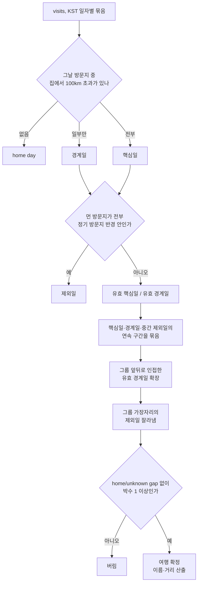

# feat: Add travel tab with trip detail pages

## Summary

헤더에 `/travel` 탭을 추가하고, 최근 여행 목록과 여행별 상세 페이지(지도 경로·일자별 방문지·지출·교통수단·일상 변화·건강)를 만든다. 그 전에 여행 판정 엔진을 다시 세운다 — 집에서 100km 초과 + 1박 이상을 기준으로, 본가처럼 등록된 정기 방문지 구간은 잘라낸다.

---

## Problem Frame

여행 하나를 재구성할 재료는 이미 다 있다. 제주 3박4일만 봐도 방문지 30건, 지출 93만원 전액, 이동수단 분해, 코딩 시간 급락이 남아 있다. 그런데 이걸 볼 화면이 없고, 재료를 담을 `trips` 테이블은 16개월간 11건뿐이며 그중 4건은 본가 방문이다.

판정 규칙에 두 가지 결함이 있다. 첫째, "그날 모든 방문지가 집에서 50km 초과"라는 규칙이 출발일과 도착일을 구조적으로 잘라낸다 — 그 날들은 집 근처 방문이 섞여 있기 때문이다. 제주 3박4일이 기록에 남았다면 2일짜리였을 것이다. 둘째, 본가는 `saved_places`에 등록돼 있지만 `category`가 비어 있어 home 판별이 이를 인식하지 못하고, 서울 집에서 135km라 50km 임계값을 매번 통과한다.

감지가 멈춘 것은 별개 원인이다. 기존 11건의 `created_at`이 전부 `2026-06-27 12:16` 한 시점 — 수동 백필 흔적이고, 매주 일요일 02:00로 등록된 크론은 한 건도 넣은 적이 없다. 다른 크론은 정상이다. 커밋 동기화·위치 처리·지하철 갱신은 부팅 시 밀린 작업을 따라잡지만 여행 감지만 그 체인에 없어서, 배포가 일요일 02:00을 걸치면 그 주가 조용히 건너뛰어진다.

---

## Requirements

R-ID는 origin 요구사항 문서와 동일한 번호를 그대로 쓴다. 두 문서 사이 추적은 같은 ID로 이뤄진다.

**여행 판정**

- R1. 집에서 100km를 초과하는 지점에서 1박 이상 머문 구간을 여행으로 판정한다.
- R2. 하루의 모든 방문지가 100km를 초과하는 날을 핵심일로 보고, 앞뒤로 100km 초과 방문지가 하나라도 있는 날까지 여행 기간에 포함한다.
- R3. 박수가 0인 구간은 여행으로 판정하지 않는다.
- R4. 정기 방문지로 표시된 장소 반경 안에서만 머문 날은 판정에서 제외한다.
- R5. 제외된 날이 여행 기간 앞뒤에 붙어 있으면 잘라내고, 남은 구간이 R1~R3을 다시 만족할 때만 여행으로 남긴다.
- R6. 여행 감지는 주기적으로 자동 실행된다.
- R7. 컨테이너 부팅 시 사용자별 마지막 성공 감지 시점 이후 밀린 구간을 따라잡는다.

**여행 목록 (`/travel`)**

- R8. 헤더에 여행 탭을 추가하고 기존 탭의 활성 상태 표시 방식을 따른다.
- R9. 최근순으로 정렬된 여행 카드 목록을 보여준다.
- R10. 각 카드는 여행 이름, 날짜 범위와 N박M일, 국내/해외 구분, 총 지출, 방문지 수를 담는다.
- R11. 각 카드에서 "여행 아님"으로 표시하면 목록에서 사라지고, 해당 지역이 정기 방문지로 등록되어 이후 재방문도 여행으로 잡히지 않는다.

**여행 상세**

- R12. 여행 카드를 클릭하면 상세 페이지로 이동한다.
- R13. 여행 기간 GPS 경로를 지도에 그리고 방문지를 핀으로 표시한다.
- R14. 일자별 방문지 타임라인을 보여준다. 각 항목은 상호명, 도착 시각, 체류 시간을 담는다.
- R15. 지출을 카테고리별 합계와 개별 거래로 보여주고 총비용과 1일 평균을 낸다.
- R16. 교통수단별 이동 거리 구성을 보여준다.
- R17. 여행 기간 코딩 시간과 커밋 수를 평소 대비로 보여준다.
- R18. 건강 지표를 보여주되 해당 기간에 데이터가 없으면 블록을 숨긴다.

**데이터 보정**

- R19. 여행 이름은 좌표 기반 국가 판별과 검증된 국내 광역단체명으로 생성한다. 원시
  `countryName`은 쓰지 않고, 국내 `city`는 17개 광역단체 화이트리스트를 통과한 값만 쓴다.
- R20. 여행의 총 이동 거리를 산출해 저장한다.
- R21. `flying` 판정을 보정한다.
- R22. 기존 `trips`를 삭제하고 2025-03-08부터 새 규칙으로 재생성한다.

---

## Key Technical Decisions

**여행 제외 반경을 지도 핀 반경과 분리하고, 생활권 크기로 잡는다.** `saved_places`에 `exclude_from_trips`와 `trip_exclusion_radius_m`를 추가한다. 본가 핀은 반경 100m가 맞지만 여행 제외에는 10km 규모가 필요하다. 본가에 머무는 동안 실제 방문지가 유성온천역 8.0km, 남대전 5.5km, 판암 3.0km까지 퍼진다 — 본가 방문은 집 안에 갇힌 체류가 아니라 대전 생활권 전체를 쓰는 체류다. 반경을 2km로 잡으면 2026-02-15·16이 제외되지 않아 본가 3박이 여행으로 남는다. `radius_m`를 키워 해결하면 지도 핀과 장소 매칭이 같이 뭉개진다.

**날짜를 핵심일·경계일·제외일·home/unknown으로 분류한다.** 기존 `allAway` 단일 규칙이
출발·도착일을 잘라내는 원인이다. 핵심일(모든 방문지가 멀다)로 여행의 존재를 판정하고,
경계일(먼 방문지가 하나라도 있다)로 기간을 확장한다. 핵심일·경계일·중간 제외일로만 이어진
연속 구간을 만들고, home 또는 관측이 없는 unknown 날짜에서는 반드시 끊는다. 따라서 단순한
1일 gap 허용으로 서로 다른 당일치기를 1박 여행으로 합치지 않는다.

**여행 이름은 좌표 기반 국가 판별 + 광역단체 화이트리스트로 만든다.** 해외는
`src/modules/report/travel.ts`의 `detectCountry`를 재사용하되, 홍콩처럼 큰 국가 경계에 포함되는
세부 지역을 먼저 평가하도록 경계 우선순위를 고친다. 국내는 `visits.city` 값을 17개 광역단체명
화이트리스트에 통과시켜 가장 빈번한 값을 쓴다. 원시 `countryName`과 화이트리스트 밖의 city는
이름에 사용하지 않는다. 매칭 실패 시 `국내 여행`.

**총 이동 거리는 `tracks.distanceMeters` 합으로 낸다.** 궤적 거리는 이미 track 생성 시점에 계산돼 저장돼 있다. GPS 포인트로 다시 적분하면 같은 값을 두 번 계산하면서 이상치 처리 기준만 갈라진다.

**flying 임계값은 손으로 고르지 않고 라벨된 집합에 맞춰 보정한다.** 실제 비행 5건(타이베이·다낭·도쿄·홍콩·제주)은 날짜로 특정되고 나머지 67건은 오탐이다. `scripts/calibrate-subway-matcher.ts`와 같은 방식으로 보정 스크립트를 두고 거리·평균속도·최고속도 임계값을 이 집합에 맞춘다. 현재 규칙(평균 150km/h 이상 + 최고 200km/h 이상)은 KTX와 최고속도 1,000~16,000km/h로 기록된 GPS 튐을 함께 통과시킨다.

**과거 이동 세그먼트 재산출은 별도 수동 실행으로 둔다.** flying 보정은 다른 화면(인사이트 교통수단, 보고서)의 숫자도 같이 바꾸고 16개월치 재산출은 시간이 걸린다. 기존 위치 백필 경로에 얹어 설정에서 사용자가 시점을 정해 돌린다.

**모든 여행 쓰기는 사용자별 DB 잠금과 트랜잭션을 공유한다.** 크론·부팅 캐치업·위치 백필·수동
재생성·감지 확인·"여행 아님"이 같은 사용자 여행을 동시에 바꿀 수 있다. 프로세스 메모리 플래그는
보조 가드로만 두고, PostgreSQL advisory transaction lock 아래에서 자동 여행을 조정한다. 자동
후보가 기존 자동 여행과 겹치면 skip하지 않고 해당 연결 구간을 교체하며, 수동 여행은 보존한다.

**재생성은 후보 선계산 후 원자적으로 교체한다.** 전체 후보를 먼저 계산·검증하고, 잠금과 단일
트랜잭션 안에서 해당 사용자의 `auto_detected = true` 행만 삭제한 뒤 후보를 삽입한다. 감지·삭제·삽입
중 하나라도 실패하면 기존 여행을 그대로 보존하고 API를 실패로 끝낸다.

**여행 전량 재생성도 설정의 수동 버튼으로 둔다.** 되돌릴 수 없는 작업이고, 판정 엔진이 완성된 뒤 한 번만 돌리면 된다. 배포 시 자동 실행은 판정 규칙을 손볼 때마다 예고 없이 데이터를 갈아엎는다.

**API는 기존 `/api/trips` 그룹을 확장한다.** `/api/trips`는 이미 인사이트 탭과 `TripDetectDialog`가 쓰고 있고 `[id]` 폴더도 있다. 새 그룹을 파면 같은 도메인이 두 갈래로 갈린다.

---

## High-Level Technical Design

판정 파이프라인. `visits`를 KST 날짜로 묶어 3종으로 분류하고, 핵심일로 그룹을 만든 뒤 경계일로 확장하고 제외일을 잘라낸다.

origin 인수 예시가 이 파이프라인을 통과하는 방식:

| 사례 | 핵심일 | 경계일 | 결과 |
|---|---|---|---|
| 제주 07-15~18 | 07-16, 07-17 | 07-15, 07-18 | 3박4일 |
| 본가 10-24~25 | 둘 다 제외일 | — | 버림 |
| 본가 3박 + 전남 02-14~18 | 02-17 (02-14~16은 제외일) | 02-18 | 전남 1박2일 |

02-14~16이 제외일이 되려면 제외 반경이 대전 생활권을 덮어야 한다. 그 3일의 방문지가 본가에서 0~8km에 퍼져 있어, 반경이 좁으면 이 행이 성립하지 않는다.
| 경북 당일 01-24 | 01-24 | 없음 | 박수 0, 버림 |

---

## Implementation Units

### Phase 1 — 데이터 기반

### U1. 스키마 확장

- **Goal:** 여행 제외 장소와 여행 메타데이터를 담을 컬럼을 추가한다.
- **Requirements:** R4, R11, R20
- **Dependencies:** 없음
- **Files:**
  - `src/db/schema.ts`
  - `drizzle/` (생성될 마이그레이션)
- **Approach:** `saved_places`에 `exclude_from_trips boolean not null default false`와
  `trip_exclusion_radius_m integer`를 추가한다. 후자가 null이면 판정 시 기본값을 쓴다. `trips`에는
  `auto_detected boolean not null default false`를 추가하고, 자동 감지의 마지막 성공일을 저장할
  `users.trip_detection_last_through text`를 추가한다. 기존 11건은 전부 백필 스크립트가 만든 자동
  감지 여행이므로 마이그레이션에서 `true`로 채운다. `persistTrips`와 크론·백필·감지 확인 등 모든
  자동 writer는 반드시 `autoDetected: true`를 명시하고, 수동 POST만 기본값 false를 쓴다.
- **Patterns to follow:** 기존 마이그레이션(`drizzle/0021_*` 이후)의 컬럼 추가 방식. `yarn db:generate` 후 생성된 SQL을 검토하고 커밋.
- **Test scenarios:** Test expectation: none — 스키마 변경만. 검증은 마이그레이션 적용 후 컬럼 존재와 기존 행 값 확인.
- **Verification:** `yarn db:migrate` 후 두 테이블에 새 컬럼이 존재하고, `trips` 11건이 모두 `auto_detected = true`이며, `saved_places` 3건이 모두 `exclude_from_trips = false`다.

### U2. 판정 엔진 재작성

- **Goal:** 핵심일·경계일 2단계 분류와 정기 방문지 제외, 가장자리 트리밍을 구현한다.
- **Requirements:** R1, R2, R3, R4, R5
- **Dependencies:** U1
- **Files:**
  - `src/modules/location/services/trip-detector.ts`
  - `src/modules/location/services/trip-detector.test.ts`
- **Approach:** `detectTrips`의 날짜 분류를 HTD 다이어그램대로 다시 짠다. `HOME_DISTANCE_THRESHOLD_M`을 100km로 올린다. `getHomeLocation`은 `category` 매칭 실패 시 이름이 `집`/`home`인 saved place도 보도록 넓힌다 — 현재 fallback이 최다 체류 좌표를 쓰는데 우연히 맞았을 뿐이다. 제외 판정은 `saved_places`에서 `exclude_from_trips = true`인 행을 미리 읽어 각 visit을 반경 안/밖으로 라벨링한다. `MIN_DOMESTIC_DAYS` 상수는 박수 기준(R3)으로 대체되어 사라진다.
- **Execution note:** origin 인수 예시 4건이 실제 날짜와 좌표를 갖고 있으므로 실패하는 테스트부터 쓰고 시작한다.
- **Test scenarios:**
  - Covers AE1. 07-15에 서울·제주 방문이 섞이고 07-16·07-17이 전부 제주, 07-18에 제주·서울이 섞인 입력 → 07-15~07-18 하나의 여행, 박수 3.
  - Covers AE2. 본가 반경 안 방문만 있는 연속 2일 입력 → 여행 0건.
  - Covers AE3. 본가 3일 + 전남 1일 + 전남·서울 혼합 1일 입력 → 전남 구간만 남고 시작일이 본가 마지막 날 다음으로 트리밍된다.
  - Covers AE4. 집에서 270km 지점 당일 왕복 입력 → 여행 0건.
  - 제외 장소 중심에서 8km 떨어진 방문지만 있는 날 → 제외 반경 기본값 안에 들어와 제외일로 분류된다. 이 시나리오가 AE3를 지탱한다.
  - 제외 장소가 여행 중간에 낀 입력(멀리 → 본가 → 다시 멀리) → 하나의 여행으로 유지되고 중간 날이 잘리지 않는다.
  - 핵심일 사이의 하루가 유효 경계일 또는 중간 제외일 → 하나의 여행으로 유지된다.
  - 핵심일 사이의 하루가 home 또는 관측 없는 unknown → 두 여행으로 분리된다.
  - 월요일·수요일 원거리 당일치기 사이 화요일 visits가 없음 → 2개의 0박 후보가 모두 버려진다.
  - visits가 0건인 기간 → 빈 배열 반환, 예외 없음.
  - home 판별 불가(saved place 없음, visits 없음) → 빈 배열 반환.
- **Verification:** 위 시나리오가 모두 통과하고, 실제 DB 2025-03-08~2026-07-22 구간에 돌렸을 때 본가·논산 방문이 결과에 없고 제주·홍콩·다낭·도쿄·타이베이·광주가 있다.

### U3. 여행 이름과 총 이동 거리

- **Goal:** 좌표에서 읽을 수 있는 이름을 만들고 총 이동 거리를 채운다.
- **Requirements:** R19, R20
- **Dependencies:** U2
- **Files:**
  - `src/modules/location/services/trip-naming.ts` (신규)
  - `src/modules/location/services/trip-naming.test.ts` (신규)
  - `src/modules/location/services/trip-detector.ts`
- **Approach:** 해외 판정은 `src/modules/report/travel.ts`의 `detectCountry`를 재사용하되 중첩 경계는
  더 구체적인 지역(홍콩)을 먼저 평가한다. 국내는 17개 광역단체명(정식·약칭 모두)
  화이트리스트로 `visits.city`를 거른 뒤 최빈값을 쓴다. 원시 `countryName`과 검증되지 않은 city는
  사용하지 않는다. 어느 쪽도 못 정하면 `국내 여행` / `해외 여행`. 총 이동 거리는 KST 여행 기간과
  겹치는 `tracks.distanceMeters`의 합으로 계산한다.
- **Test scenarios:**
  - 홍콩 좌표 여행 → 이름이 `홍콩`. 오염된 country 값(`赤鱲角國際機場1號客運大樓`)이 입력에 있어도 결과에 반영되지 않는다.
  - 제주 좌표 여행 → 이름이 `제주` 계열 광역단체명.
  - city가 `목척7길`, `06628,`뿐인 여행 → 화이트리스트 미통과, `국내 여행`으로 폴백.
  - 두 국가를 걸친 여행 → 두 국가명이 모두 이름에 들어간다.
  - 여행 기간에 track이 하나도 없는 경우 → 거리 null, 예외 없음.
- **Verification:** 실제 DB 재감지 결과에 `赤鱲角 Sky Plaza Rd 여행` 같은 이름이 하나도 없고, 모든 여행이 0이 아닌 거리를 갖거나 track 부재가 근거로 설명된다.

### U4. flying 판정 보정

- **Goal:** 실제 비행만 `flying`으로 남기고 KTX와 GPS 튐을 걸러낸다.
- **Requirements:** R21
- **Dependencies:** 없음
- **Files:**
  - `scripts/calibrate-flight-detection.ts` (신규)
  - `src/modules/location/services/transportation/mode-classifier.ts`
  - `src/modules/location/services/transportation/mode-classifier.test.ts`
  - `src/modules/location/services/transportation/movement-analyzer.ts`
  - `src/modules/location/services/transportation/movement-analyzer.test.ts`
  - `src/modules/location/services/transportation/reclassify.ts` (신규)
  - `src/app/api/settings/transportation-reclassify/route.ts` (신규)
  - `src/modules/settings/components/TripDetectionCard.tsx`
- **Approach:** 라벨 집합은 실제 비행 여행 5건의 출·도착 세그먼트와 나머지 오탐 세그먼트다.
  보정 스크립트가 거리·평균속도·최고속도 임계값 조합의 정밀도/재현율을 출력한다.
  `classifyMode`에 `distanceMeters`를 전달하고, `movement-analyzer`가 이미 계산한 `totalDist`를 넘긴다.
  임계값과 라벨 집합은 테스트 가능한 모듈로 공유해 스크립트와 런타임 상수가 어긋나지 않게 한다.
  설정의 수동 재분류는 날짜 범위를 받아 기존 위치 파이프라인으로 세그먼트를 재산출하며 진행·실패를
  표시한다.
- **Test scenarios:**
  - 2,409km / 최고 16,279km/h 세그먼트 → 최고속도 이상치를 제거한 뒤에도 `flying`으로 남는다.
  - 52km / 평균 285km/h / 최고 1,901km/h 세그먼트 → `flying`이 아니다.
  - 473km 제주 구간 → `flying`.
  - 172km 다낭 구간(포인트가 성긴 실제 비행) → `flying`.
  - 기존 `mode-classifier.test.ts`의 walking/cycling/driving/train 케이스가 전부 그대로 통과한다.
- **Verification:** 보정 스크립트가 라벨 집합에서 오탐 0에 가까운 임계값을 보고하고, 그 임계값으로 기존 테스트가 깨지지 않는다.

### U5. 크론 부팅 캐치업과 재생성 경로

- **Goal:** 배포가 예약 시각을 걸쳐도 여행 감지가 밀리지 않게 하고, 전량 재생성 수단을 만든다.
- **Requirements:** R6, R7, R22
- **Dependencies:** U2, U3
- **Files:**
  - `src/lib/cron.ts`
  - `src/lib/cron.test.ts`
  - `src/modules/location/services/backfill-orchestrator.ts`
  - `src/app/api/settings/trip-regenerate/route.ts` (신규)
  - `src/modules/settings/components/TripDetectionCard.tsx`
- **Approach:** 부팅 캐치업 체인(현재 커밋 동기화 → 지출 분류 → 위치 처리 → 지하철)에 여행 감지를
  순차 항목으로 추가한다. 사용자별 `trip_detection_last_through`에서 경계 재구성을 위한 look-behind를
  두고 시작하며, 위치 처리 성공과 여행 저장 transaction이 모두 완료된 뒤에만 워터마크를 전진시킨다.
  자동 여행 후보가 기존 자동 여행과 겹치면 연결된 자동 행을 교체하고 수동 행은 보존한다. 모든 writer는
  동일한 사용자별 PostgreSQL advisory transaction lock을 쓴다. 재생성은 후보를 먼저 계산한 뒤 단일
  transaction에서 해당 사용자의 자동 여행만 교체하며, 기존 backfill의 non-fatal trips catch를
  재사용하지 않는다.
- **Test scenarios:**
  - 부팅 캐치업 체인이 여행 감지를 호출하고, 앞 단계가 실패해도 뒤 단계가 계속 실행된다.
  - 감지가 이미 실행 중이면 부팅 캐치업이 건너뛴다(단일 실행 가드).
  - 재생성 모드가 `auto_detected = true` 행만 삭제하고 수동 생성 행은 남긴다.
  - 재생성을 두 번 연속 실행해도 결과 여행 수가 같다.
  - 감지 또는 삽입 실패를 주입하면 기존 자동 여행이 그대로 남고 API가 실패한다.
  - 크론과 재생성을 동시에 실행해도 중복 없이 하나의 일관된 자동 여행 집합만 남는다.
  - 120일 넘게 중단된 사용자도 마지막 성공 워터마크 이후 여행을 모두 따라잡는다.
  - 여행 중 저장된 짧은 자동 행이 귀가 후 재감지에서 전체 기간으로 갱신된다.
- **Verification:** 재생성 실행 후 `trips`에 본가·논산이 없고 제주·홍콩·다낭·도쿄·타이베이가 있으며, 컨테이너를 재시작하면 로그에 여행 감지 캐치업이 남는다.

### Phase 2 — 화면

### U6. 여행 조회 API

- **Goal:** 목록·상세·경로 데이터를 서빙한다.
- **Requirements:** R9, R10, R13, R14, R15, R16, R17, R18
- **Dependencies:** U2, U3
- **Files:**
  - `src/app/api/trips/route.ts`
  - `src/app/api/trips/[id]/route.ts`
  - `src/app/api/trips/[id]/route-points/route.ts` (신규)
  - `src/modules/travel/service.ts` (신규)
  - `src/modules/travel/service.test.ts` (신규)
- **Approach:** `/api/trips`의 GET에 `limit`/`cursor` 기반 최근순 조회를 더한다. `year` 파라미터
  경로는 인사이트 탭이 쓰고 있으므로 그대로 둔다. 상세 서비스는 인증된 `user.id`만 입력으로 받고,
  trip 조회와 visits, transportation_segments, transactions, commits, coding_daily_stats,
  health_daily_summaries의 모든 쿼리에 같은 user predicate를 둔다. 지출 집계는
  `src/modules/spending/classify.ts`의 `bucketSql`을 재사용한다. 날짜 경계는 KST 날짜를 UTC wall-time
  `[start, end)`로 한 번 변환해 기존 복합 인덱스를 탄다. 경로 포인트는 별도 엔드포인트에서 사용자
  소유권을 확인한 뒤 SQL window/time-bucket sampling으로 DB 반환 행을 상한 이하로 줄이고, 그 제한된
  결과에만 정확도·최소 거리 단순화를 적용한다.
- **Patterns to follow:** `src/app/api/timeline/locations/route.ts`의 다운샘플, `src/modules/spending/service.ts`의 카테고리 집계, `src/lib/api-handler.ts`의 `withAuth`.
- **Test scenarios:**
  - 인증 없는 요청 → 401.
  - 다른 사용자의 여행 ID로 상세 요청 → 404 또는 403, 데이터가 새지 않는다.
  - 같은 날짜에 다른 사용자의 visits·거래·커밋·건강·GPS가 있어도 응답에 섞이지 않는다.
  - 다른 사용자의 여행 ID로 경로 요청 → 404, GPS 데이터가 새지 않는다.
  - 존재하지 않는 여행 ID → 404.
  - 지출 집계가 자기 이체와 무시 계좌를 제외하고, 같은 기간 소비 탭 합계와 일치한다.
  - 여행 기간에 건강 데이터가 없으면 해당 필드가 비어 오고 예외가 나지 않는다.
  - 84,831개 입력에서 DB 반환·역직렬화 행과 응답이 상한 이하이며 시간순·양 끝점을 유지한다.
  - `year` 파라미터 조회가 기존과 동일하게 동작한다(인사이트 탭 회귀).
- **Verification:** 제주 여행 상세 응답의 총 지출이 93만원대이고, 교통수단 구성에 비행 2건이 잡히며, 건강 필드가 빈 상태로 온다.

### U7. 헤더 탭과 여행 목록 페이지

- **Goal:** `/travel`에서 최근 여행 목록을 본다.
- **Requirements:** R8, R9, R10, R12
- **Dependencies:** U6
- **Files:**
  - `src/components/Layout/Header.tsx`
  - `src/app/travel/page.tsx` (신규)
  - `src/modules/travel/hooks.ts` (신규)
  - `src/modules/travel/components/TripCard.tsx` (신규)
- **Approach:** 헤더 링크는 소비·포트폴리오·건강·인사이트와 같은 구조로 추가한다. 페이지는 `src/app/health/page.tsx`의 뼈대(인증 가드, 로딩 스피너, 빈 상태 카드)를 따른다. 카드는 이름, 날짜 범위와 N박M일, 국내/해외 배지, 총 지출, 방문지 수를 담고 상세로 링크한다.
- **Patterns to follow:** `src/app/health/page.tsx`, `src/modules/insights/components/primitives/InsightCard.tsx`.
- **Test scenarios:**
  - 여행이 0건일 때 빈 상태 문구가 렌더되고 에러가 아니다.
  - 카드가 최근순으로 정렬돼 렌더된다.
  - 해외 여행 카드에 해외 배지가, 국내 여행 카드에는 붙지 않는다.
  - 총 지출이 없는 여행에서 지출 자리가 깨지지 않는다.
- **Verification:** `/travel`에서 제주가 맨 위에 오고, 헤더의 여행 탭이 현재 경로에서 활성 표시된다.

### U8. 여행 상세 — 지도와 타임라인

- **Goal:** 여행 경로와 일자별 방문지를 본다.
- **Requirements:** R12, R13, R14
- **Dependencies:** U6, U7
- **Files:**
  - `src/app/travel/[tripId]/page.tsx` (신규)
  - `src/modules/travel/components/TripRouteMap.tsx` (신규)
  - `src/modules/travel/components/TripTimeline.tsx` (신규)
- **Approach:** 지도는 `react-map-gl/mapbox`의 Source/Layer로 경로 라인을, Marker로 방문지 핀을 그린다. 라이트/다크 스타일 분기와 토큰 사용은 기존 지도 컴포넌트를 따른다. 초기 뷰포트는 여행 방문지 전체를 감싸는 bounds로 맞춘다. 타임라인은 방문지를 KST 일자별로 묶어 상호명·도착 시각·체류 시간을 세로로 쌓는다.
- **Patterns to follow:** `src/modules/report/components/TravelMap.tsx`(스타일 분기, Source/Layer 구성), `src/modules/location/components/LocationMap.tsx`.
- **Test scenarios:**
  - Covers R14. 여행 기간이 4일이면 타임라인이 4개 날짜 그룹으로 나뉜다.
  - 방문지가 하나뿐인 여행에서 지도 bounds 계산이 깨지지 않는다.
  - Mapbox 토큰이 없을 때 지도 자리가 안내 문구로 대체되고 페이지 전체가 죽지 않는다.
  - 상호명이 없는 방문지(주소만 있는 경우)가 주소로 표시된다.
- **Verification:** 제주 여행 상세에서 협재해수욕장·넥슨뮤지엄·맥파이탭룸이 날짜별로 나뉘어 보이고, 지도에 제주 서부 경로가 그려진다.

### U9. 여행 상세 — 지출·교통수단·일상 변화·건강

- **Goal:** 여행의 비용과 이동 구성, 일상 변화를 본다.
- **Requirements:** R15, R16, R17, R18
- **Dependencies:** U6, U8
- **Files:**
  - `src/modules/travel/components/TripSpendingCard.tsx` (신규)
  - `src/modules/travel/components/TripTransportCard.tsx` (신규)
  - `src/modules/travel/components/TripRoutineCard.tsx` (신규)
  - `src/app/travel/[tripId]/page.tsx`
- **Approach:** 지출은 카테고리별 합계를 먼저, 개별 거래를 접어서 보여준다. 총비용과 1일 평균을 상단에 낸다. 교통수단은 모드별 거리 구성을 보여준다. 일상 변화는 여행 기간 코딩 시간·커밋 수를 여행 직전 같은 일수 평균과 비교한다. 건강 블록은 응답에 데이터가 없으면 렌더하지 않는다.
- **Test scenarios:**
  - Covers AE6. 건강 데이터가 없는 여행 → 건강 블록이 DOM에 없고, 나머지 블록은 정상 렌더된다.
  - 지출이 0건인 여행 → 총비용 0으로 표시되고 1일 평균 계산에서 0으로 나누지 않는다.
  - 카테고리가 null인 거래가 섞여도 집계가 깨지지 않는다.
  - 여행 직전 비교 구간에 데이터가 없으면 비교 없이 절대값만 보여준다.
- **Verification:** 제주 여행 상세에서 교통 40만·식비 30만 계열의 카테고리 분해가 보이고, 건강 블록은 렌더되지 않는다.

### U10. "여행 아님" 처리

- **Goal:** 잘못 잡힌 여행을 목록에서 치우고 재발을 막는다.
- **Requirements:** R11, R4
- **Dependencies:** U1, U6, U7
- **Files:**
  - `src/app/api/trips/[id]/not-a-trip/route.ts` (신규)
  - `src/modules/travel/components/TripCard.tsx`
  - `src/modules/settings/components/SavedPlacesSettings.tsx`
  - `src/app/api/saved-places/[id]/route.ts`
  - `src/modules/location/hooks.ts`
- **Approach:** 엔드포인트가 사용자별 advisory transaction lock을 얻고, 소유한 여행의 지배적 체류
  중심을 구해 `exclude_from_trips = true`인 saved place를 만들거나 기존 행을 재사용한 뒤 같은
  transaction에서 여행을 삭제한다. 감지·재생성과 같은 잠금을 공유해 완료된 사용자 정정이 진행 중
  감지에 의해 되돌아가지 않게 한다. 되돌리기는 saved-place PUT API와 클라이언트 타입/훅을 확장해
  설정 화면에서 제외 표시를 끄도록 제공한다.
- **Test scenarios:**
  - Covers AE5. 논산 좌표 여행에 "여행 아님" 적용 → 여행이 삭제되고 제외 장소가 생성된다. 이후 같은 좌표로 재감지를 돌리면 여행이 만들어지지 않는다.
  - 이미 제외 장소가 있는 지역에 적용 → 중복 생성하지 않고 기존 장소를 쓴다.
  - 장소 생성 뒤 여행 삭제 실패를 주입 → transaction rollback, 둘 다 변경되지 않는다.
  - 진행 중 감지와 동시에 실행 → 완료 뒤 여행이 다시 생기지 않는다.
  - 다른 사용자의 여행 ID로 요청 → 거부되고 장소가 만들어지지 않는다.
  - 방문지가 여러 지역에 흩어진 여행에 적용 → 제외 장소가 지배적 체류 지역에 생성된다.
  - 설정에서 제외 표시를 끈 뒤 재감지 → 해당 지역이 다시 여행으로 잡힌다.
- **Verification:** 논산 여행에 적용 후 재생성을 돌려도 논산이 목록에 다시 나타나지 않고, 설정에서 되돌리면 나타난다.

---

## Scope Boundaries

### 이번 범위 밖 (origin에서 이월)

- 여행 제목과 메모의 직접 편집. 이름은 자동 생성만으로 읽을 만해야 한다.
- 여행 계획, 버킷리스트, 다녀올 곳 관리.
- 사진.
- 누적 세계지도와 연도별 여행 통계. 인사이트 탭이 이미 담당한다.
- 항공권·숙박 선결제처럼 여행 기간 밖에서 발생한 지출의 귀속.

### 후속 작업으로 미룸

- 과거 이동 세그먼트 전량 재산출. U4가 분류기를 고치지만 16개월치 소급 적용은 설정에서 수동 실행하며, 실행 시점은 사용자가 정한다.
- 여행 감지 파이프라인 밖의 위치 처리(체류지 감지, 지오코딩, 지하철 매칭)는 손대지 않는다.
- `visits.city`/`countryName` 오염 자체의 정리. 이번엔 이름 생성에서 우회하는 것으로 끝낸다.

---

## Risks & Dependencies

**전량 재생성은 되돌릴 수 없다.** U5의 재생성이 자동 감지 여행을 삭제한다. 현재 `trips`에 사용자가 입력한 `notes`는 0건이라 잃을 데이터가 없지만, 실행 전에 이 사실을 다시 확인한다. 수동 생성 여행을 삭제 대상에서 빼는 것이 방어선이다.

**판정 임계값 변경이 인사이트 탭 숫자를 바꾼다.** 인사이트의 여행 카드가 같은 `trips` 테이블을 읽는다. 재생성 후 연도별 여행 횟수와 방문지 목록이 달라진다. 의도된 변화지만 예고 없이 바뀌면 버그로 보인다.

**flying 보정은 다른 화면에도 번진다.** `transportation_segments`는 인사이트 교통수단 카드와 보고서가 함께 읽는다. 소급 적용을 수동으로 분리한 이유가 이것이고, 실행 시 어느 화면의 숫자가 바뀌는지 사용자가 알고 눌러야 한다.

**home 판별이 여전히 취약하다.** `saved_places`의 `category`가 비어 있어 현재 fallback이 최다 체류 좌표를 쓰고 있고, 지금은 우연히 서울 집이 나온다. U2가 이름 매칭을 더하지만, 사용자가 장기 출장을 가면 fallback이 다른 곳을 집으로 볼 수 있다. 100km 임계값이 이 취약성 위에 서 있다.

**경로 포인트 응답 크기.** 4일 여행이 84,831 포인트다. 다운샘플 상한을 너무 올리면 응답이 무거워지고, 너무 낮추면 경로가 각진다. 상한은 실제 여행 4~5건으로 눈으로 확인해 정한다.

---

## Open Questions

**구현 중 결정**

- 정기 방문지 제외 반경의 기본값. 본가 체류 중 방문지가 0~8km에 퍼지므로 10km 규모가 출발점이지만, 넓힐수록 대전을 지나는 실제 여행을 잘못 지울 위험이 커진다. U2 테스트를 2025-03-08 이후 전 구간에 돌려 본가·논산이 걸러지면서 전남·광주·제주가 살아남는 최소값을 쓴다.
- "여행 아님"이 만드는 제외 장소의 반경. 여행 방문지의 산포도에서 유도할지 기본값을 쓸지.
- 경로 포인트 다운샘플 상한.

---

## Sources / Research

- `src/modules/location/services/trip-detector.ts` — 현재 판정 로직. `HOME_DISTANCE_THRESHOLD_M`(50km), `MIN_DOMESTIC_DAYS`(2), `allAway` 규칙, `getHomeLocation`의 category 의존과 최다 체류 좌표 fallback.
- `src/lib/cron.ts` — 여행 감지 주간 크론(`0 2 * * 0`, 120일 윈도우) 등록부와, 여행 감지가 빠져 있는 부팅 캐치업 체인.
- `src/modules/location/services/backfill-orchestrator.ts` — 5단계 백필 파이프라인. 5단계가 이미 trips 감지라 재생성이 새 경로를 요구하지 않는다.
- `src/modules/location/services/transportation/mode-classifier.ts` — `FLYING_MIN`(평균 150km/h), `FLYING_THRESHOLD`(최고 200km/h). KTX와 GPS 튐이 함께 통과하는 지점.
- `scripts/calibrate-subway-matcher.ts` — 라벨 집합에 임계값을 맞추는 기존 보정 스크립트 형식.
- `src/modules/report/travel.ts` — 좌표 기반 국가 판별 `COUNTRY_BOUNDS` / `detectCountry`. 이름 생성에 재사용.
- `src/app/api/timeline/locations/route.ts` — 정확도 필터와 최소 거리 다운샘플(`MAX_POINTS` 500, `MIN_DISTANCE_M` 100). 다일 경로용으로 상한만 조정해 재사용.
- `src/modules/spending/classify.ts` / `src/modules/spending/service.ts` — `bucketSql` 기반 지출 분류. 여행 총비용이 소비 탭과 같은 기준을 쓰도록 재사용.
- `src/db/sql.ts` — `localDaySql`. UTC wall time 컬럼에서 KST 달력일을 뽑는 유일한 올바른 방법.
- `src/app/health/page.tsx` — 최근 추가된 탭 페이지의 뼈대(인증 가드, 로딩, 빈 상태).
- `src/modules/report/components/TravelMap.tsx` — Mapbox Source/Layer 구성과 라이트/다크 스타일 분기.
- 실측: 여행 기간 GPS 포인트 84,831건(4일), 해당 기간 `tracks` 4건. 본가 체류 3일(2026-02-14~16) 방문지의 본가 기준 거리가 0.0~8.0km에 퍼짐 — 제외 반경 기본값의 근거. `trips` 11건 전부 `created_at`이 `2026-06-27 12:16` 한 시점이고 `notes`는 전부 비어 있음. `flying` 세그먼트 72건 중 실제 비행 5건, 오탐의 최고속도가 1,000~16,279km/h.
