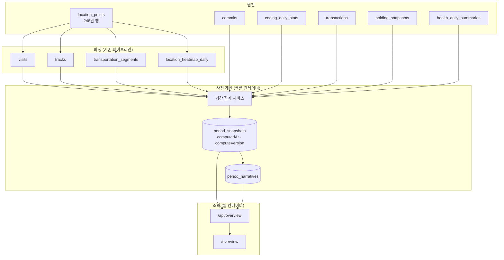
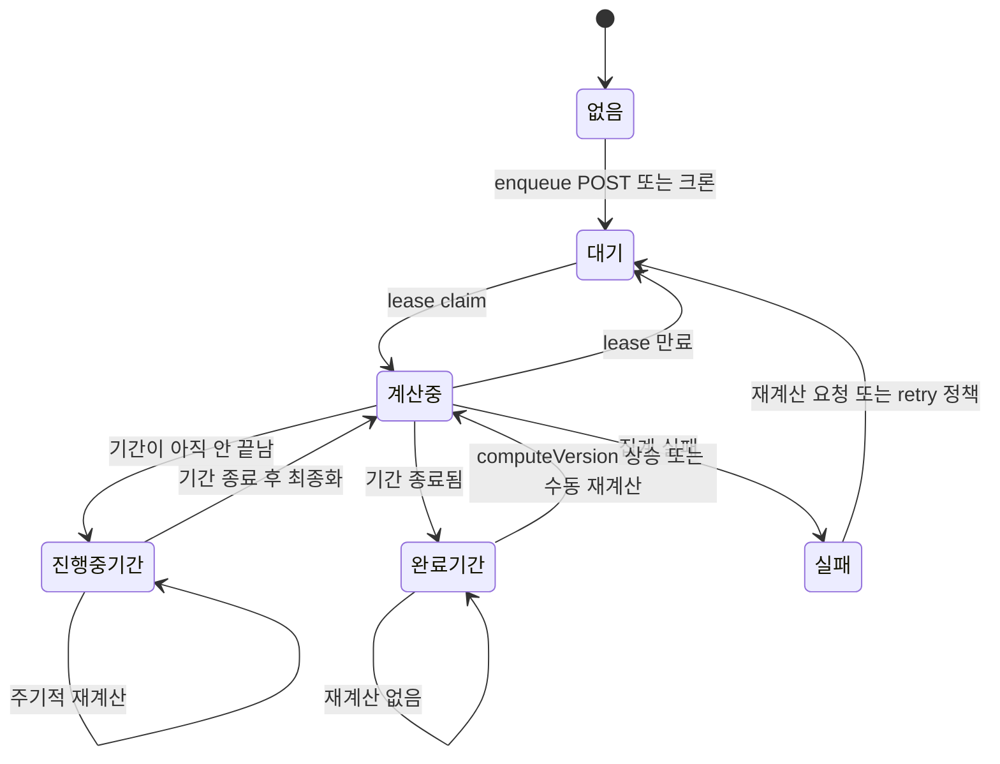

# feat: 인사이트·보고서·건강을 단일 대시보드로 통합

## Summary

`/insights`, `/report`, `/health`를 `/overview` 단일 대시보드로 통합하고 소비·자산의 조회 콘텐츠를 요약으로 흡수한다. 모든 집계는 크론이 기간 단위로 사전 계산해 저장하고, 화면은 저장된 값과 기준 시각을 읽는다. AI 회고문은 DB에 저장되고 크론이 주·월·연 단위로 자동 생성한다. 관리 성격 기능은 기존 전용 화면에 그대로 둔다.

---

## Problem Frame

세 가지가 겹쳐 있다 (origin: `docs/brainstorms/2026-07-22-unified-dashboard-requirements.md`).

**중복.** 히트맵·스트릭·장소 생산성·지하철·교통수단·여행·체성분이 `src/modules/insights/components/`와 `src/modules/report/components/`에 각각 구현되어 있다. `PlaceProductivityCard.tsx`는 파일명까지 같은 채로 두 벌 존재한다.

**커버리지 불균형.** `src/modules/report/service.ts`는 `transactions`·`holdingSnapshots`·`brokerage*`를 한 번도 참조하지 않고, `src/modules/insights/service.ts`는 걸음수·수면·심박을 참조하지 않는다.

**요청 시점 집계.** 실측(개발 DB, Tailscale 경유): 인사이트 연간 배치 4,423ms, 보고서 연간 위치 8,792ms, 보고서 월간 위치(enriched) 3,603ms, 보고서 월간 커밋 153ms. 병목은 위치에 집중되며 원인은 `src/modules/report/service.ts:1243-1375`가 246만 행 `location_points`를 윈도우 함수로 스캔하는 것이다. 인사이트는 파생 테이블만 쓴다.

여기에 회고문 미저장(`src/app/api/reports/monthly/route.ts`가 생성 결과를 반환만 함)과 최소 단위가 월이라는 점이 "열어도 새 정보가 없다"는 감각을 만든다.

**조사에서 정정된 전제.** origin R11은 "위치 처리 주기 상향"으로 썼으나, `src/lib/cron.ts:838`에 이미 매시 15분 캐치업이 있다. 실제 문제는 주기가 아니라 `src/lib/cron.ts:519`의 미처리일 조회가 `< todayStr`로 **당일을 구조적으로 제외**하는 것이다. R11은 "당일 포함"으로 재해석해 U5에서 다룬다.

---

## Requirements

origin의 R1–R25를 그대로 승계한다. 아래는 구현 단위 매핑이다.

| 영역 | origin 요구사항 | 담당 유닛 |
|---|---|---|
| 정보 구조 | R1–R6 | U8, U9, U10 |
| 데이터 신선도·성능 | R7–R12 | U1, U2, U3, U4, U5, U6 |
| 콘텐츠 통합 | R13–R18 | U3, U9 |
| AI 회고문 | R19–R22 | U7 |
| 이관·호환 | R23–R25 | U8, U10 |

origin의 AE1–AE6은 U5·U6·U7·U8·U9의 테스트 시나리오에 `Covers AE<N>` 표기로 연결한다.

---

## Key Technical Decisions

**KTD1. 사전 계산은 기간 스냅샷으로 저장한다. 일 단위 롤업 합산이 아니다.**
표시 지표 상당수가 비가산적이다 — 연속 기록(스트릭)은 일별 값의 합이 아니고, 고유 방문 장소 수는 중복 제거가 필요하며, 통근 소요 시간 백분위와 TWR은 일별 결과에서 복원할 수 없다. 일 단위 집계를 저장하고 조회 시 합산하면 이 지표들이 전부 틀린다. 저장 단위는 `(userId, periodType, periodKey)`이고 `periodType`은 `recent | week | month | year`다. 개인 앱이라 행 수는 사용자당 연 수백 건 규모로 저장 비용이 문제되지 않는다.

**KTD2. 진행 중 기간은 갱신하고, 종료 직후 한 번 최종화한 뒤 불변으로 둔다.**
진행 중 기간(이번 주·이번 달·올해·최근 창)은 주기적으로 재계산한다. 주·월·연이 종료되면 위치 파이프라인이 마지막 입력을 반영한 뒤 정확히 한 번 최종 재계산하고 `finalizedAt`을 기록한다. 그 뒤에는 `computeVersion` 상승 또는 수동 재계산만 다시 연다. 이 최종화 단계가 없으면 기간 종료 직전 마지막 주기 이후 들어온 데이터가 영구 누락된다.

**KTD3. 위치 집계는 파생 테이블과 일별 히트맵 롤업만 읽는다.**
방문·이동·교통수단 통계는 `visits`·`tracks`·`transportationSegments`로 산출한다. 위치 히트맵만 원본 점이 필요하므로 위치 파이프라인이 처리한 KST 일자별 grid count를 `locationHeatmapDaily`에 delete-and-rebuild로 저장한다. 기간 스냅샷은 이 가산 가능한 일별 롤업만 합산한다. 비가산 지표는 KTD1대로 기간 스냅샷에서 직접 계산하고, 시간별 잡이 연간 `location_points`를 다시 스캔하지 않는다.

**KTD4. GET은 스냅샷만 읽고, 계산 등록은 명시적인 POST가 담당한다.**
GET은 `ready | pending | computing | failed | missing` 판별만 반환하며 DB 상태를 바꾸지 않는다. `missing`을 받은 클라이언트가 동일 출처 검증을 거친 enqueue POST를 한 번 호출하고 이후 폴링한다. enqueue와 recompute는 unique upsert와 사용자별 작업 예산으로 멱등성을 보장한다.

**KTD5. 새 경로는 `/overview`다.**
`/dashboard`는 이미 커밋 타임라인과 지도가 쓰고 있다. `/insights`를 재사용하면 보고서·건강·소비까지 담은 페이지에 "인사이트"라는 부분집합 이름이 남는다.

**KTD6. 카드 통합 기준은 인사이트 쪽 구현이다.**
인사이트가 나중에 만들어졌고 `data-neon` 토큰과 `src/modules/insights/components/primitives/`의 카드 프리미티브가 정리되어 있다. 보고서 전용 콘텐츠는 이 프리미티브로 이식한다.

**KTD7. 회고문은 주·월·연 전부 자동 생성한다.**
`(userId, periodType, periodKey)` 유니크로 저장하고, 각 기간 종료 직후 크론이 생성한다. 연 65회 호출이며 사용자가 명시적으로 선택한 트레이드오프다.

**KTD8. 사전 계산 잡은 크론 컨테이너에서만 돈다.**
집계는 다초 단위 CPU 작업이다. 웹 컨테이너에서 돌리면 HTTP 요청이 막힌다 — 이 프로젝트가 이미 겪어 컨테이너를 분리한 이유다. `instrumentation.ts`의 `DISABLE_CRON` 분기를 그대로 따른다.

**KTD9. 계산과 회고문 생성은 lease 기반으로 복구한다.**
`computing`/`generating` 전이는 시작 시각과 lease 만료를 함께 기록한다. 크론 부팅과 매 tick은 만료된 작업을 다시 `pending`으로 돌리고, 원자적 claim에 성공한 작업만 실행한다. 기간 스냅샷은 한 번에 최대 5개를 현재 기간 우선, 요청된 기간, 최신 완료 기간 순으로 처리해 computeVersion 상승이나 장기 중단이 기존 잡을 굶기지 않게 한다.

---

## High-Level Technical Design

### 데이터 흐름

### 갱신 규칙

### 기간 모델

| periodType | periodKey 예 | 범위 | 갱신 |
|---|---|---|---|
| `recent` | `2026-07-22` | 종료일 기준 최근 14일 | 매 계산 주기 |
| `week` | `2026-W30` | 월–일 (KST) | 진행 중일 때만 |
| `month` | `2026-07` | 월초–월말 (KST) | 진행 중일 때만 |
| `year` | `2026` | 1/1–12/31 (KST) | 진행 중일 때만 |

---

## Implementation Units

### Phase A — 데이터 기반

#### U1. 기간 모델과 사전 계산 저장소

**Goal:** 기간 키 계산 헬퍼와 스냅샷 저장 스키마를 세운다. 이후 모든 유닛이 이 위에 선다.

**Requirements:** R7, R8

**Dependencies:** 없음

**Files:**
- `src/db/schema.ts` — `periodSnapshots` 테이블 추가
- `drizzle/0030_*.sql` — 생성된 마이그레이션
- `src/modules/overview/period.ts` — 기간 키·범위 헬퍼
- `src/modules/overview/period.test.ts`

**Approach:**
`periodSnapshots`는 `(userId, periodType, periodKey)` 유니크다. 코딩·위치·건강·소비·자산은 각각 `{ data, status, computedAt, computeVersion, errorCode }` envelope인 jsonb 컬럼으로 저장한다. 행에는 전체 상태(`pending | computing | ready | failed`), `computeStartedAt`, `leaseExpiresAt`, `attemptCount`, `lastError`, `finalizedAt`을 둔다. 전체 `ready`는 성공한 영역이 게시 가능한 상태라는 뜻이며, 일부 영역 실패는 해당 envelope에 남겨 다른 네 영역을 계속 읽을 수 있게 한다.

기간 헬퍼는 `periodType + periodKey → { from, toExclusive }`와 그 역함수, 그리고 "이 기간이 진행 중인가" 판정을 제공한다. 모든 경계는 `src/lib/utils.ts`의 `startOfLocalDay`/`endOfLocalDay`/`toLocalDateString`을 쓴다. `date.toISOString().split("T")[0]`은 UTC 일이라 금지다.

**Patterns to follow:** `src/db/schema.ts:419`의 `dataUsageCache`가 `calculatedAt`을 가진 사전 계산 캐시의 기존 선례다. 마이그레이션은 `yarn db:generate` → `drizzle/`에 생성.

**Test scenarios:**
- `2026-07-22`(수요일)에 대해 `week` 키가 `2026-W30`이고 범위가 07-20 00:00 KST부터 07-27 00:00 KST 직전까지다
- 연말 경계: `2026-12-31`의 주가 다음 해로 넘어가는 ISO 주 번호를 만들 때 키와 범위가 일치한다
- KST 00:00–09:00 시각으로 기간 키를 계산해도 UTC 전날로 밀리지 않는다
- 진행 중 판정: 오늘이 포함된 월은 진행 중, 지난달은 완료로 나온다
- `recent` 범위가 종료일을 포함하고 14일 전 00:00 KST부터 시작한다
- 만료된 `computing` lease가 `pending`으로 복구되고 시도 횟수가 보존된다
- 영역별 `computedAt`이 다르고 한 영역만 실패한 상태를 저장·조회할 수 있다

**Verification:** 마이그레이션이 로컬 DB에 적용되고, 기간 헬퍼 테스트가 전부 통과한다.

---

#### U2. 위치 집계를 파생 테이블 기반으로 재작성

**Goal:** 8.8초짜리 원본 스캔을 파생 테이블 질의로 대체한다. 이 플랜의 성능 목표 대부분이 여기서 나온다.

**Requirements:** R7

**Dependencies:** U1

**Files:**
- `src/modules/overview/aggregate/location.ts`
- `src/modules/overview/aggregate/location.test.ts`
- `src/db/schema.ts` — `locationHeatmapDaily` 테이블 추가
- `drizzle/0031_*.sql`

**Approach:**
`src/modules/report/service.ts`의 위치 집계(1243–1375행 인근)가 `location_points`에서 뽑는 지표를 항목별로 분해해, `visits`·`tracks`·`transportationSegments`로 산출 가능한 것과 아닌 것을 나눈다. 이동 거리·체류 시간·장소 목록·교통수단 분포는 전부 파생 테이블에서 나온다 — `src/modules/insights/service.ts`의 `getPlaceProductivity`, `getTransportModes`, `getTrips`가 이미 그 패턴이다.

남는 건 위치 히트맵의 좌표 그리드 하나다. 위치 파이프라인이 처리한 KST 일자에 대해 소수점 3자리 grid count를 `locationHeatmapDaily`에 delete-and-rebuild하고, 기간 집계는 해당 일별 행만 합산한다(KTD3). 요청 경로와 시간별 기간 집계는 `location_points`를 직접 읽지 않는다.

**Execution note:** 기존 보고서 집계와 결과를 대조할 수 있으므로, 재작성 전에 현재 출력에 대한 characterization 테스트를 먼저 만든다. 파생 테이블 기반 결과가 원본 기반과 어디서 얼마나 달라지는지가 검증의 핵심이다.

**Patterns to follow:** `src/modules/insights/service.ts`의 파생 테이블 질의. SQL에서 KST 일을 뽑을 때는 `src/db/sql.ts`의 `localDaySql`.

**Test scenarios:**
- 같은 기간에 대해 파생 테이블 기반 총 이동거리가 원본 기반 값의 허용 오차 안에 든다
- 방문이 0건인 기간에 빈 결과를 반환하고 예외를 던지지 않는다
- 자정을 걸친 방문이 양쪽 날짜가 아니라 시작 시각 기준 하루에만 집계된다
- 교통수단 분포의 비율 합이 100%가 된다 (`unknown` 포함)
- 기간 히트맵 함수가 `locationHeatmapDaily`만 읽고 `location_points`를 호출하지 않는다
- 같은 KST 일자를 두 번 롤업해도 grid 행과 count가 중복되지 않는다
- 기간에 `transportation_segments`는 있고 `tracks`는 없는 경우에도 부분 결과를 반환한다

**Verification:** 최근 12개월 각각에 대해 신·구 결과를 비교한 스크립트 출력이 허용 오차 안에 들고, 정상 시간별 패스가 현재 처리일 밖의 `location_points`를 스캔하지 않으며 기간 질의가 밀리초 단위로 끝난다.

---

#### U3. 통합 기간 집계 서비스

**Goal:** 한 기간에 대해 다섯 영역(코딩·위치·건강·소비·자산)의 payload를 만드는 단일 진입점.

**Requirements:** R13, R14, R15, R16, R17

**Dependencies:** U1, U2

**Files:**
- `src/modules/overview/aggregate/index.ts`
- `src/modules/overview/aggregate/coding.ts`
- `src/modules/overview/aggregate/health.ts`
- `src/modules/overview/aggregate/spending.ts`
- `src/modules/overview/aggregate/portfolio.ts`
- `src/modules/overview/aggregate/index.test.ts`
- `src/modules/overview/types.ts`

**Approach:**
영역별 집계 함수를 만들고 상위에서 조합한다. 기존 로직은 최대한 재사용한다 — 코딩은 `src/modules/insights/service.ts`와 `src/modules/report/service.ts`에 흩어진 커밋·코딩 집계를 기간 파라미터로 일반화하고, 건강은 `src/modules/health/service.ts`와 `src/modules/insights/service.ts`의 `getBody`를 합치고, 소비는 `src/modules/spending/service.ts`의 `SpendingTrendService`와 `src/modules/spending/classify.ts`의 버킷 분류를 쓰고, 자산은 `src/modules/portfolio/returns.ts`의 TWR 계산과 `holdingSnapshots` 조회를 쓴다.

기존 인사이트 API가 겪었던 커넥션 풀 고갈(`src/app/api/insights/route.ts` 주석)을 반복하지 않도록 영역을 순차 실행한다. 각 영역은 독립된 짧은 트랜잭션(또는 명시적 savepoint)에서 계산하고, 결과 envelope를 모은 뒤 마지막 짧은 트랜잭션으로 스냅샷을 게시한다. PostgreSQL에서 한 문장이 실패해도 다른 영역의 트랜잭션은 aborted되지 않는다.

한 영역이 실패해도 나머지는 저장되어야 한다. 실패 영역은 `failed` envelope와 errorCode를 기록하고, 성공 영역은 그대로 게시한다.

**Patterns to follow:** `src/app/api/insights/route.ts`의 단일 트랜잭션 팬아웃. 서비스 팩토리 형태는 `createReportService(db)`, `createHealthSyncService(db)`.

**Test scenarios:**
- 다섯 영역 payload가 모두 채워진 기간에 대해 각 영역 키가 존재한다
- 자산 계정이 없는 사용자는 자산 영역이 빈 결과이고 나머지 네 영역은 정상이다
- 한 영역이 예외를 던져도 나머지 네 영역이 저장 가능한 형태로 반환되고 실패 영역만 실패로 표시된다
- 실제 PostgreSQL statement 실패 뒤에도 다른 네 영역이 커밋된다
- 같은 기간을 두 번 집계하면 동일한 payload가 나온다 (결정론)
- 기간 유형이 `year`일 때 origin R14가 요구하는 보고서 전용 지표(언어 추이, 프로젝트 타임라인, 커밋 유형)가 payload에 포함된다
- 기간 유형이 `week`일 때 연간 전용 지표는 payload에서 빠진다 — Covers AE3

**Verification:** 실제 개발 DB에 대해 주·월·연 각 1개 기간을 집계해 다섯 영역이 채워지고, 전체 소요가 원본 스캔 시절보다 유의하게 짧다.

---

#### U4. 사전 계산 크론 잡과 갱신 규칙

**Goal:** 스냅샷을 만들고 유지하는 백그라운드 잡.

**Requirements:** R9, R10, R12

**Dependencies:** U3

**Files:**
- `src/lib/cron.ts` — 잡 등록
- `src/modules/overview/precompute.ts`
- `src/modules/overview/precompute.test.ts`

**Approach:**
갱신 규칙은 KTD2와 KTD9를 따른다. 진행 중 기간(최근·이번 주·이번 달·올해)은 주기적으로 재계산한다. 방금 종료된 주·월·연은 위치 파이프라인의 해당 사용자/날짜 완료 watermark를 확인한 뒤 최종 재계산하고 `finalizedAt`을 기록한다. 완료 기간은 없거나 computeVersion이 낮거나 명시적 recompute 상태일 때만 다시 계산한다.

매 tick은 만료 lease 복구 후 최대 5개를 원자적으로 claim한다. 우선순위는 진행 중 기간, 사용자 enqueue 기간, 최신 미최종화 기간, computeVersion 백필 순이다. 사용자 한 명의 실패는 다음 사용자를 막지 않으며, 실패 작업은 오류와 시도 횟수를 남기고 bounded retry 대상이 된다.

주기는 위치 파이프라인 뒤에 붙인다. 매시 15분에 위치 캐치업이 돌고(`src/lib/cron.ts:838`), 그 직후에 사전 계산이 돌아야 갓 만들어진 visits/tracks가 반영된다. 위치 함수는 사용자/날짜별 성공 결과 또는 completed-through watermark를 반환하며, 필요한 위치 창이 실패한 사용자는 그 tick의 위치 스냅샷 게시에서 제외한다.

기존 잡들과 같은 단일 실행 가드 패턴을 쓴다. 이 가드는 인메모리라 크론 컨테이너 단일 인스턴스를 전제로 한다 — 기존 제약을 그대로 승계하며 복제본을 늘리지 않는다.

**Patterns to follow:** `src/lib/cron.ts`의 `isLocationProcessingRunning` 단일 실행 가드, `cron.schedule(..., { timezone: "Asia/Seoul", name })` 등록 형태. 타임존을 명시적으로 넘기는 이유는 파일 내 주석 참조.

**Test scenarios:**
- 진행 중인 이번 달 스냅샷은 재실행 시 `computedAt`이 갱신된다
- 완료된 지난달 스냅샷은 재실행해도 `computedAt`이 그대로다
- `computeVersion`이 코드 쪽보다 낮은 완료 기간 스냅샷은 재계산된다
- `pending`으로 등록된 기간이 다음 실행에서 `ready`가 된다 — Covers AE2
- 기간 경계 직전 데이터가 마지막 진행 중 계산 뒤 들어와도 다음 tick에서 정확히 한 번 최종화된다
- `computing` 설정 직후 프로세스가 중단되어도 lease 만료 뒤 `pending`으로 복구된다
- 위치 처리에 실패한 사용자의 완료 기간은 `ready`/`finalized`로 게시되지 않는다
- computeVersion 백필이 있어도 한 tick에서 5개를 넘겨 처리하지 않는다
- 이미 실행 중일 때 재진입하면 즉시 반환하고 중복 계산하지 않는다
- 한 사용자의 집계가 실패해도 다음 사용자 처리가 계속된다
- 스냅샷이 하나도 없는 신규 사용자에 대해 진행 중 기간 네 개가 생성된다

**Verification:** 크론을 수동 트리거하면 진행 중 기간 스냅샷이 만들어지고, 다시 트리거해도 완료 기간은 재계산되지 않는다.

---

#### U5. 위치 파이프라인 당일 처리

**Goal:** "최근" 뷰가 오늘 데이터를 반영할 수 있게 한다.

**Requirements:** R11

**Dependencies:** 없음 (독립적으로 먼저 배포 가능)

**Files:**
- `src/lib/cron.ts` — 미처리일 조회에서 당일 제외 해제
- `src/lib/cron.test.ts`

**Approach:**
`src/lib/cron.ts:519`의 미처리일 조회는 `(timestamp ...)::date < ${todayStr}::date`로 당일을 제외한다. 이 조건을 풀어 진행 중인 오늘도 처리 대상에 넣는다.

재실행 안전성은 이미 확보되어 있다 — `detectAndPersistVisits`는 해당 날짜 창의 기존 방문을 지우고 다시 만든다(`src/modules/location/services/visit-persister.ts:98-108`). 진행 중인 날에 매시 실행하면 그 시점까지의 데이터로 다시 만들어지므로 하루가 끝나면 자연스럽게 최종 형태가 된다. 궤적·교통수단 단계도 같은 성질인지 확인하고, 아니면 그 단계에만 당일 처리를 제한한다.

당일을 넣으면 매시 실행 대상 일수가 늘어난다. 미처리일 조회의 `LIMIT 30`과 45일 시간 경계는 그대로 두어 스캔 범위가 커지지 않게 한다.

각 사용자/날짜 파이프라인은 단계별 성공 결과를 반환하고, visits/tracks/transportation이 모두 성공한 날짜만 completed-through watermark를 전진시킨다. 같은 성공 경로에서 U2의 `locationHeatmapDaily`를 해당 일자 기준으로 다시 만든다. 실패를 내부 로그만 남기고 성공처럼 resolve하지 않는다.

**Execution note:** 궤적·교통수단 단계의 재실행 멱등성을 먼저 테스트로 고정한 뒤 당일 제외를 푼다. 멱등하지 않은 단계가 있으면 중복 행이 쌓인다.

**Test scenarios:**
- 오늘 날짜가 처리 대상 목록에 포함된다
- 같은 날을 두 번 처리해도 방문 행 수가 두 배가 되지 않는다
- 같은 날을 두 번 처리해도 궤적·교통수단 구간 행 수가 두 배가 되지 않는다
- 오전에 처리한 뒤 오후 데이터가 추가되면 재처리 시 오후 방문이 반영된다 — Covers AE1
- 위치 데이터가 없는 날은 처리 대상에서 조용히 빠진다
- 처리 대상 일수가 늘어도 미처리일 조회의 45일 경계가 유지된다
- 한 단계가 실패하면 해당 사용자/날짜 watermark와 heatmap rollup이 완료로 표시되지 않는다

**Verification:** 크론을 수동 실행한 뒤 `tracks`와 `transportation_segments`의 최신 시각이 당일로 올라오고, 반복 실행에도 행 수가 안정적이다.

---

### Phase B — 조회와 회고문

#### U6. 통합 대시보드 조회 API

**Goal:** 스냅샷을 읽어 상수 시간으로 응답하는 API.

**Requirements:** R7, R8, R10, R12

**Dependencies:** U1, U4

**Files:**
- `src/app/api/overview/route.ts`
- `src/app/api/overview/recompute/route.ts`
- `src/modules/overview/service.ts`
- `src/modules/overview/service.test.ts`

**Approach:**
GET은 `periodType`과 `periodKey`를 받아 스냅샷만 읽는다. 없으면 `missing`을 반환하며 DB를 변경하지 않는다(KTD4). 응답은 `missing | pending | computing | ready | failed` discriminated union이고, ready/failed에서는 영역별 envelope와 `computedAt`을 포함한다.

POST recompute는 missing 기간의 최초 enqueue와 기존 기간의 강제 재계산을 함께 담당한다(R12). 동일 출처를 검증하고, 사용자 소유 기간만 upsert하며, canonical 기간 키만 허용한다. 미래 기간과 사용자 데이터/보존 범위 밖 기간은 거절하고 사용자별 outstanding `pending | computing` 상한을 적용한다. 이미 처리 중이면 409, 예산을 넘으면 429를 반환한다.

인증은 `src/lib/api-handler.ts`의 `withAuth`/`withValidation`을 쓴다. 요청 경로에서 집계 함수를 직접 호출하지 않는다 — 이 규칙을 테스트로 고정한다.

**Patterns to follow:** `src/app/api/portfolio/summary/route.ts`의 `withAuth` 사용. 오류는 `ApiError(status, message, code)`.

**Test scenarios:**
- 준비된 스냅샷이 있는 기간을 요청하면 payload와 영역별 기준 시각이 함께 온다
- 스냅샷이 없는 기간을 요청하면 계산 중 상태로 즉시 응답하고 스냅샷이 `pending`으로 등록된다 — Covers AE2
- 스냅샷이 없는 GET은 `missing`을 반환하고 DB를 변경하지 않는다
- enqueue POST 뒤 `pending`이 등록되고 같은 요청을 반복해도 한 행만 존재한다 — Covers AE2
- 같은 미존재 기간을 연속 요청해도 `pending` 등록이 중복되지 않는다
- 잘못된 `periodType`이나 형식이 어긋난 `periodKey`는 400을 반환한다
- 미인증 요청은 401을 반환한다
- 다른 사용자의 스냅샷은 조회되지 않는다
- recompute 호출 후 해당 기간이 재계산 대상으로 표시된다
- 미래/범위 밖 기간과 outstanding 상한 초과는 작업을 만들지 않는다
- 이미 계산 중인 기간은 409, 작업 예산 초과는 429를 반환한다
- 요청 처리 경로가 집계 함수를 호출하지 않는다

**Verification:** 어떤 기간을 요청해도 첫 응답이 상수 시간이고, 미존재 기간 요청이 크론 실행 후 준비 상태로 바뀐다.

---

#### U7. 회고문 저장과 자동 생성

**Goal:** 회고문이 저장되고, 주·월·연 기간 종료 후 자동으로 생성된다.

**Requirements:** R19, R20, R21, R22

**Dependencies:** U1, U4

**Files:**
- `src/db/schema.ts` — `periodNarratives` 테이블
- `drizzle/0032_*.sql`
- `src/modules/overview/narrative.ts`
- `src/modules/overview/narrative.test.ts`
- `src/app/api/overview/narrative/route.ts`
- `src/lib/cron.ts` — 생성 잡 등록
- `prompts/` — 기간 유형별 프롬프트 자산

**Approach:**
`(userId, periodType, periodKey)` 유니크로 저장하고 `status`, `generationStartedAt`, `leaseExpiresAt`, `attemptCount`, `lastError`, `generatedAt`, 모델 식별자를 남긴다. 생성 입력은 final ready 스냅샷 payload를 쓴다 — 회고문 생성이 집계를 다시 돌리지 않는다.

프롬프트는 `src/modules/report/prompts.ts`의 기존 월간·연간 프롬프트를 출발점으로 삼고 주간을 추가한다. 프롬프트 자산은 `prompts/`에 두는 기존 관례(`prompts/commit-system-prompt.txt`)를 따른다.

매 tick과 크론 부팅 시 final ready 스냅샷 중 회고문이 없는 주·월·연 기간을 오래된 순으로 bounded batch 조회한다. 주간은 월요일, 월간은 매월 1일, 연간은 1월 1일에 첫 대상이 되지만 정확한 경계 tick을 놓쳐도 다음 실행에서 catch-up된다. 만료된 generation lease는 다시 pending으로 돌리고 실패는 다음 실행에서 재시도하되 대시보드 렌더링을 막지 않는다(R22).

POST는 수동 재생성이며 사용자 범위 조회, 동일 출처 검증, per-user 빈도 제한, 원자적 generation lease를 거친다. 동시/너무 잦은 요청은 409/429로 거절하고, AI 호출이 성공한 뒤에만 기존 회고문을 대체한다(R21).

**Patterns to follow:** `src/lib/adapters/ai/claude.ts`의 `createClaudeAdapter`. 현재 `src/app/api/reports/monthly/route.ts`의 POST 핸들러가 생성 흐름의 참고점이지만 저장이 없다는 점이 이 유닛이 고치는 부분이다.

**Test scenarios:**
- 생성된 회고문이 저장되고 재조회 시 API 호출 없이 반환된다 — Covers AE4
- 같은 기간에 대해 재생성하면 기존 행이 대체되고 중복 행이 생기지 않는다
- AI 호출이 실패하면 회고문은 비어 있고 스냅샷 조회는 정상 응답한다 — Covers AE5
- 스냅샷이 아직 준비되지 않은 기간은 회고문 생성을 건너뛴다
- 주·월·연 각 기간 유형에 대해 서로 다른 프롬프트가 선택된다
- 생성 실패 후 다음 실행에서 재시도된다
- 경계 시각에 크론이 꺼져 있어도 다음 부팅/tick에서 누락 회고문이 생성된다
- 동시 재생성은 AI 호출 하나만 실행하고, 실패 시 기존 회고문을 보존한다
- 다른 사용자의 회고문은 조회되지 않는다

**Verification:** 지난주·지난달 기간에 대해 잡을 수동 실행하면 회고문이 저장되고, 대시보드에서 버튼 없이 표시된다.

---

### Phase C — 화면

#### U8. 대시보드 셸과 기간 전환

**Goal:** `/overview` 라우트, 기간 전환 UI, 기준 시각 표시, 계산 중 상태.

**Requirements:** R1, R2, R3, R4, R8, R10, R25

**Dependencies:** U6

**Files:**
- `src/app/overview/page.tsx`
- `src/app/overview/layout.tsx`
- `src/modules/overview/hooks.ts`
- `src/modules/overview/components/PeriodSwitcher.tsx`
- `src/modules/overview/components/AsOfBadge.tsx`
- `src/modules/overview/components/ComputingState.tsx`

**Approach:**
기본 뷰는 `recent`다(R2). 기간 상태는 URL 쿼리로 유지한다(R3). 데이터 조회는 인사이트 훅의 단일 요청 패턴을 따르고, 보고서 훅의 8개 병렬 요청 패턴은 가져오지 않는다.

`recent` 기본 창 길이는 14일로 확정한다. 7일은 주 단위와 구분이 흐리고 30일은 "최근"이라기엔 길다.

`missing` 응답을 받으면 클라이언트가 enqueue POST를 한 번 호출한다. `pending | computing` 동안만 폴링하고, `failed`에서는 폴링을 중단해 오류와 재계산 동작을 표시한다. 폴링은 페이지가 보일 때만 돌도록 `src/lib/hooks/usePageVisible.ts`를 쓴다.

날짜 계산은 전부 `src/lib/utils.ts` 헬퍼를 쓴다(R25). 현재 `src/app/report/page.tsx:105`가 `new Date().toISOString().slice(0, 7)`로 UTC 월을 잡는 버그를 이식하지 않는다.

**Patterns to follow:** `src/modules/insights/hooks.ts`의 단일 배치 요청. `src/app/insights/page.tsx`의 `data-neon` 스코프와 섹션 구분자.

**Test scenarios:**
- 쿼리 파라미터 없이 접근하면 `recent` 뷰가 선택된다 — Covers AE1
- 기간 전환 시 URL이 갱신되고 새로고침 후에도 같은 기간이 유지된다
- 계산 중 응답을 받으면 계산 중 상태가 표시되고 준비되면 자동으로 내용이 채워진다 — Covers AE2
- `failed` 응답에서 폴링이 멈추고 오류와 재계산 동작이 표시된다
- 영역별 기준 시각이 다르면 각 영역에 개별 표시된다
- 페이지가 보이지 않을 때 폴링이 멈춘다
- KST 00:00–09:00 시각에 기본 기간을 계산해도 전날/전월로 밀리지 않는다
- 미인증 상태에서 접근하면 로그인으로 이동한다

**Verification:** 네 기간 유형을 오가며 URL·기준 시각·계산 중 상태가 의도대로 동작한다.

---

#### U9. 카드 통합과 이식

**Goal:** 중복 카드를 하나로 합치고, 다섯 영역 콘텐츠를 대시보드에 배치한다.

**Requirements:** R4, R5, R13, R14, R15, R16, R17, R18

**Dependencies:** U8

**Files:**
- `src/modules/overview/components/` — 통합 카드
- `src/modules/insights/components/` — 통합 대상 이동
- `src/modules/report/components/` — 이식 대상 이동
- `docs/plans/2026-07-22-001-feat-unified-dashboard-plan.md` — R18 판정 결과 기록

**Approach:**
세 갈래로 처리한다(R18).

*중복 통합* — 활동 히트맵, 스트릭, 장소 생산성, 지하철, 교통수단, 여행, 체성분. 인사이트 구현을 기준으로 삼고(KTD6) 보고서 쪽에만 있던 정보는 통합 카드에 흡수한다.

*이식* — 보고서에만 있던 언어 추이, 프로젝트 타임라인, 커밋 유형, 깊은 작업, 컨텍스트 전환, 일·시간대 버블, 스크래치 맵, 첫 방문. 인사이트 프리미티브로 옮긴다.

*신규 요약* — 건강(걸음·수면·심박·VO2max), 소비(순지출·계정 역할 반영), 자산(평가액 추이·TWR). 소비·자산은 기존 전용 화면으로, 건강은 `/overview?section=health` 전용 상태로 이동한다(R5).

R18 판정은 아래로 확정한다. 사용 로그가 없으므로 이번 통합에서 콘텐츠를 제거하지 않고, 중복만 축소한다.

| 카드군 | 판정 | 근거 |
|---|---|---|
| 활동 히트맵·스트릭·장소 생산성·지하철·교통수단·여행·체성분 | 축소 | 인사이트 구현 하나로 통합하고 보고서 전용 정보를 흡수해 중복 제거 |
| 언어 추이·프로젝트 타임라인·커밋 유형·깊은 작업·컨텍스트 전환·일/시간대 버블·스크래치 맵·첫 방문 | 유지 | 보고서에만 존재하므로 기능 유실 없이 인사이트 프리미티브로 이식 |
| 건강·소비·자산 요약 | 유지(신규) | R15-R17의 필수 범위이며 관리 기능과 분리된 조회 요약 |
| 제거 | 없음 | 사용 근거 없이 기능을 제거하지 않음 |

기간 유형별 표시 여부(R4)는 카드 메타데이터로 선언한다. 연간 스크래치 맵과 12개월 다이제스트는 `week`에서 숨는다.

**Patterns to follow:** `src/modules/insights/components/primitives/InsightCard.tsx`. 차트는 `src/app/report/page.tsx`의 `dynamic(..., { ssr: false })` 방식을 유지한다.

**Test scenarios:**
- 통합 후 같은 개념의 카드 컴포넌트가 두 모듈에 중복 존재하지 않는다
- 각 카드가 데이터 없음 상태에서 빈 상태를 렌더링하고 예외를 던지지 않는다
- 기간 유형이 `week`일 때 연간 전용 카드가 렌더링되지 않는다 — Covers AE3
- 건강 요약 카드가 걸음·수면·심박·VO2max를 모두 표시한다
- 소비 요약이 계정 역할 분류를 반영한 순지출을 보여준다
- 자산 요약에 평가액 추이와 TWR이 포함된다
- 소비·자산·건강 요약 카드에 전용 화면 링크가 있고 대시보드에는 삭제·편집 동작이 없다 — Covers AE6

**Verification:** 네 기간 유형 각각에서 다섯 영역이 모두 렌더링되고, origin R14의 보고서 전용 항목이 유지 또는 명시적 제거로 전부 처리되어 있다.

---

#### U10. 경로 리다이렉트와 내비게이션 정리

**Goal:** 구 경로를 통합 대시보드로 넘기고 헤더를 정리한다. 커버리지가 확인된 뒤 마지막에 배포한다.

**Requirements:** R6, R23, R24

**Dependencies:** U9

**Files:**
- `src/app/insights/page.tsx` — 제거 또는 리다이렉트
- `src/app/report/page.tsx` — 제거 또는 리다이렉트
- `src/app/report/comparison/page.tsx` — 제거 또는 리다이렉트
- `src/app/health/page.tsx` — 제거 또는 리다이렉트
- `src/components/Layout/Header.tsx`
- `src/modules/overview/components/` — 기간 비교 기능

**Approach:**
구 URL은 아래 매핑으로 `/overview`의 대응 상태로 넘긴다.

| 구 URL | 새 URL |
|---|---|
| `/insights?year=2026` | `/overview?period=year&key=2026` |
| `/report?type=monthly&period=2026-07` | `/overview?period=month&key=2026-07` |
| `/report?type=yearly&period=2026` | `/overview?period=year&key=2026` |
| `/report/comparison` | `/overview?mode=comparison` (기존 비교 선택값 보존) |
| `/health` | `/overview?section=health` |

기간 비교(R6)는 `src/modules/report/comparison-service.ts`를 대시보드 안의 기능으로 흡수한다. 사전 계산된 두 기간 스냅샷의 비교라 별도 집계가 필요 없다.

헤더에서 인사이트·보고서·건강 세 항목을 단일 항목으로 대체한다(R24). 소비·포트폴리오 항목은 관리 화면으로 남으므로 유지한다.

기존 페이지 파일과 더 이상 쓰이지 않는 컴포넌트를 제거한다. 이 정리가 이 플랜의 순 코드 감소분이다.

**Test scenarios:**
- `/insights`가 통합 대시보드의 연간 뷰로 넘어간다
- `/insights?year=2025`가 2025년 연간 뷰로 넘어간다
- `/report?type=monthly&period=2026-07`이 대응하는 월간 뷰로 넘어가고 기간이 보존된다
- `/report/comparison`이 비교 기능으로 넘어간다
- `/health`가 건강 영역으로 넘어간다
- 헤더에 인사이트·보고서·건강 링크가 없고 통합 항목이 하나 있다
- 소비·포트폴리오 헤더 링크는 그대로 남아 있다
- 기간 비교가 사전 계산 스냅샷만 읽고 집계를 유발하지 않는다

**Verification:** 구 경로 북마크가 전부 살아 있고, 제거된 컴포넌트를 참조하는 코드가 남아 있지 않다.

---

## Scope Boundaries

### 이번 작업에 포함되지 않음

- 거래 삭제, 알림 로그 정리, 재파싱 미리보기·적용 — `/spending`에 유지
- KIS 계좌 추가·설정, 목표 비중 편집 — `/portfolio`에 유지
- OwnTracks/WakaTime/Toss 키 관리, 위치 백필, 지하철 매칭 백필 — `/settings`에 유지
- 커밋 타임라인과 커밋 상세 — `/dashboard`에 유지
- 새로운 분석 지표 추가 — 통합과 속도가 목적이지 새 인사이트가 아니다
- 소비·자산 관리 화면의 재설계

### 후속 작업으로 미룸

- 집계 결과의 stale-while-revalidate 재검증. 사전 계산 + 기준 시각으로 먼저 검증하고 부족하면 얹는다
- 사전 계산 스냅샷의 보존 기간 정책. 저장량이 문제가 될 때 다룬다
- 크론 컨테이너 복제. 현재 단일 실행 가드가 인메모리라 복제 전에 공유 잠금이 필요하다

---

## Risks & Dependencies

| 위험 | 영향 | 완화 |
|---|---|---|
| 위치 집계 재작성이 기존 수치와 어긋남 | 사용자가 신뢰하던 숫자가 바뀜 | U2를 characterization 테스트로 시작하고, 12개월 신·구 대조를 배포 전 게이트로 둔다 |
| 사전 계산이 크론 컨테이너 CPU를 잡아 기존 잡과 경합 | 커밋 동기화·위치 처리 지연 | 한 tick 최대 5개, 현재 기간 우선순위, 히트맵 일별 롤업으로 원본 재스캔 제거 |
| 당일 처리로 매시 실행 일수 증가 | 매시 잡 소요 증가 | 미처리일 조회의 `LIMIT 30`과 45일 경계 유지. 배포 후 실행 시간 관찰 |
| 카드 이식 중 조용한 기능 유실 | 보고서 콘텐츠가 말없이 사라짐 | R18 판정을 문서에 남기고 origin R14 항목을 배포 전 대조 |
| 회고문 자동 생성이 연 65회 API 호출 | 비용 증가 | 실패 시 무한 재시도하지 않고 다음 예정 실행까지 대기 |
| 인메모리 단일 실행 가드 | 크론 복제 시 중복 계산 | 기존 제약을 승계하고 복제 전 공유 잠금 필요를 명시 |
| 크론 중단으로 `computing`/`generating` 고착 | 계산 중 화면이 영구 지속 | lease 만료 복구와 부팅 시 catch-up |
| 위치 단계 부분 실패 뒤 stale 게시 | 완료 기간 수치가 오래된 파생 데이터로 고정 | 사용자/날짜 watermark가 완료된 경우에만 게시·최종화 |

**의존:** 사전 계산은 기존 위치 파이프라인이 파생 테이블을 채우는 것에 의존한다. U5가 당일 처리를 열지 않으면 `recent` 뷰는 어제까지만 보인다 — U5는 다른 유닛과 독립이지만 R2의 가치는 U5 없이는 실현되지 않는다.

---

## System-Wide Impact

- **크론 컨테이너:** 잡 두 개 추가(사전 계산, 회고문 생성). 기존 잡과 같은 단일 실행 가드·타임존 명시 패턴을 따른다.
- **DB:** 테이블 두 개 추가(`period_snapshots`, `period_narratives`). 마이그레이션은 `scripts/migrate.ts` 경로로 CI에서 적용된다.
- **웹 컨테이너:** 요청 경로에서 무거운 집계가 사라져 커넥션 풀 압박이 줄어든다. `src/app/api/insights/route.ts`가 겪었던 풀 고갈의 근본 원인이 제거된다.
- **번들:** 페이지 세 개가 하나로 합쳐지고 중복 컴포넌트가 정리되어 순 감소가 예상된다.

---

## Open Questions

### 구현 중 해결

- `periodSnapshots` payload의 영역별 jsonb 스키마 세부 — U3에서 집계 결과 형태가 확정되면 따라온다
- 궤적·교통수단 단계의 당일 재실행 멱등성 — U5 착수 시 테스트로 먼저 확인
- 영역 payload의 구체 chart series 타입 — 각 기존 컴포넌트 이식 시 공유 타입으로 고정

---

## Sources & Research

- `src/modules/report/service.ts:1243-1375` — 원본 `location_points` 스캔. 연간 8,792ms의 출처
- `src/modules/insights/service.ts` — 파생 테이블 기반 집계 18종. U2·U3의 재사용 기반
- `src/app/api/insights/route.ts` — 단일 트랜잭션 팬아웃과 커넥션 풀 고갈 대응 주석
- `src/modules/report/hooks.ts` — 기간당 8개 병렬 요청. 이식하지 않을 패턴
- `src/lib/cron.ts:519` — 미처리일 조회의 당일 제외 조건. R11의 실제 지점
- `src/lib/cron.ts:838` — 기존 매시 15분 위치 캐치업
- `src/modules/location/services/visit-persister.ts:98-108` — 날짜 창 delete-and-rebuild. 당일 재실행 안전성의 근거
- `src/db/schema.ts:419` — `dataUsageCache`. 사전 계산 캐시의 기존 선례
- `src/app/api/reports/monthly/route.ts` — 회고문 생성 후 미저장
- `src/app/report/page.tsx:105` — UTC 월 기본값 버그
- `src/modules/spending/classify.ts`, `src/modules/portfolio/returns.ts`, `src/modules/health/service.ts` — 소비·자산·건강 집계 재사용 지점
