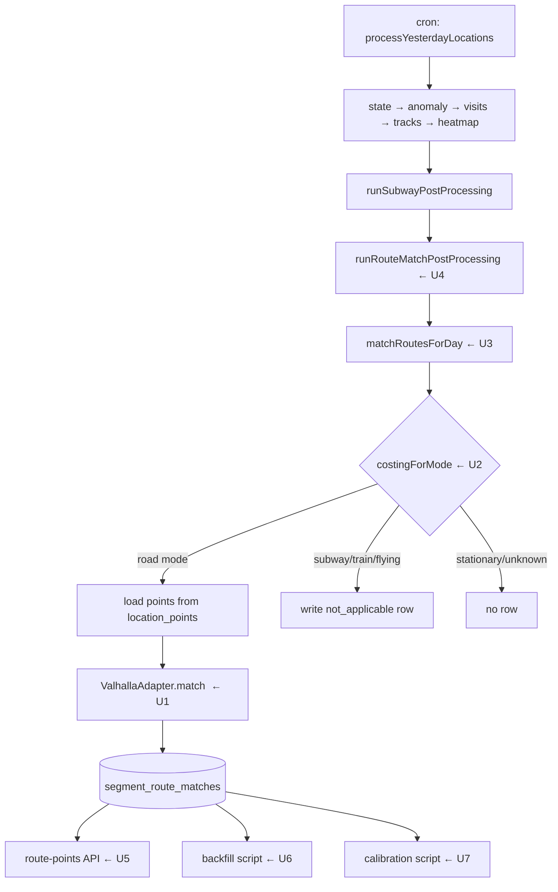

# feat: Road-network map matching pipeline (remaining work)

**Target branch:** `feat/map-matching` (already exists, 9 commits ahead of `main`)

## Summary

Snap GPS tracks to the road network using a self-hosted Valhalla, and use the snapped
geometry when drawing trips on the map.

The engine, its tiles, the HTTP adapter and the storage table are already built and reviewed
on this branch. What remains is the pipeline that connects them: pick a costing model per
segment, match a day's segments, hook that into the nightly location cron, read the snapped
shape back on the map, backfill history, and measure how detected transport modes line up
against the road classes we now know.

One design correction leads the work — the adapter currently tries to decide *why* Valhalla
failed to match, and it should not.

---

## Problem Frame

`location_points` holds raw OwnTracks GPS at roughly 6-second intervals. Drawn directly, routes
cut through buildings, sit metres off the road, and zigzag where the device drifted while
stationary. The track-splitting fix (2026-08-06) corrected which points belong to which journey
but did nothing about the shape of the line.

Mapbox's Map Matching API is the obvious answer and is unusable: Mapbox Product Terms 2.10.1
forbids exporting, caching or storing results from a Navigation API, and storing them is the
entire point. Hence self-hosting.

### What already exists on the branch

| Commit | What landed |
|---|---|
| `6cde23d`, `4ee21a8` | `src/lib/map-extracts.ts` — the OSM extracts tiles are built from, and `docker-compose.yml`'s `valhalla` service |
| `089d7f8`, `f008be5`, `06e30e0` | `scripts/probe-valhalla.ts`, `docs/map-matching/valhalla-probe-findings.md`, `docker/valhalla/entrypoint.sh` |
| `b9e52cf` | `segment_route_matches` table + migration `0041` (applied to the dev DB; table is empty) |
| `84e1bd5`, `d452b3d`, `55319d1` | `src/lib/adapters/map-matching/valhalla.ts` — the HTTP adapter |

Tests on the branch: **892 passing**. `npx tsc --noEmit` clean.

### Ground truth about Valhalla

Everything below was observed against a live instance and is recorded with pasted responses in
`docs/map-matching/valhalla-probe-findings.md`. **That document wins over any assumption.**

- Version `3.8.3-14582d257`. Endpoint `POST /trace_attributes` with `shape_match: "map_snap"`.
- `confidence_score` is **silently omitted** from the response unless explicitly named in
  `filters.attributes`. Same for `raw_score`, `admins`, `osm_changeset`, `shape`.
- `matched_points[].type` is one of `matched` | `interpolated` | `unmatched`. On a dense
  OwnTracks-shaped trace roughly half come back `interpolated` at full confidence, so keeping
  only `matched` discards most of the line. `unmatched` entries **omit `edge_index` entirely** —
  the key is absent, not null — so any `edges[p.edge_index]` lookup must be guarded.
- Error codes, all returned as HTTP 400. **No 5xx was ever produced.**
  - `444` — no road could be matched near the trace
  - `154` — trace distance exceeds `max_distance` (200 000 m)
  - `153` — trace exceeds `max_shape` (16 000 points)
  - `125` / `114` / `100` — malformed request (bad costing, missing field, bad JSON)
- All five costings are accepted: `auto`, `pedestrian`, `bicycle`, `motorcycle`, `bus`.
- No `admins.sqlite` is built, so `admins` in the response is `[{country_text: "None", …}]` —
  useless. Do not plan on it.

---

## Requirements

- **R1** Every road-mode `transportation_segments` row gets a `segment_route_matches` row
  recording what happened when we tried to snap it.
- **R2** Non-road modes (`subway`, `train`, `flying`) get a row too, marked `not_applicable`.
  `stationary` and `unknown` get **no row** — for those the question doesn't apply, permanently.
  So "no row" means *either* "never applicable" or "not processed yet"; a re-run selector must
  filter by mode as well as by row absence. Within a single mode, absence does mean unprocessed,
  which is what makes re-running tractable.
- **R3** Matching failure never fails the day's location processing.
- **R4** Trip routes on the map use snapped geometry where it exists and fall back to raw GPS
  where it doesn't, with no visible discontinuity.
- **R5** History (about 3 385 road-mode segments) can be backfilled without re-detecting visits
  or tracks.
- **R6** We can measure detected transport mode against matched road class, to decide later
  whether road class should feed mode classification.

---

## Key Technical Decisions

### KTD1 — The adapter stops inferring *why* a match failed

**Decision.** On `error_code 444` the adapter reports `no_road_match` and nothing more. It does
not consult `MAP_EXTRACTS` bboxes.

**Why.** `444` is byte-identical for "we never built tiles for this area" (fixable — add an
extract) and "tiles exist but the person wasn't on a road" (a park, a lake — nothing to fix).
The adapter was made to guess by testing coordinates against the bboxes of extracts we built,
and that guess was wrong in both directions across two review rounds:

- bboxes derived from visit history were **narrower** than the tiles, so Yokohama — inside the
  Kanto tiles — reported as a coverage gap, manufacturing work.
- bboxes derived from the `.poly` vertex envelope were **far wider**, because Kanto's `.poly`
  reaches Ogasawara (20.1°N) and Minamitorishima (154.5°E). That inflated one extract from
  0.29 to 340 deg² and swallowed Osaka, Kyoto and Nagoya — so a future Osaka trip would be
  filed as "tiles exist, no road here" and adding an Osaka extract would never revisit it.

The answer is only ever needed when someone asks *"what should I re-run now that coverage
changed?"* — and at that moment the current extract list is available and the raw coordinates
are still in `location_points`. Deciding then is both simpler and more correct: the judgement
can be fixed without re-running any matching, and it can't go stale when coverage changes.

**Consequence.** `isPointCovered` / `bboxes` in `src/lib/map-extracts.ts` lose their only
consumer. Leave the file's tile-building role intact (see U1).

### KTD2 — The status is named for what was observed

`no_coverage` asserts a cause the adapter cannot know. Rename to **`no_road_match`** — Valhalla
found no road near this trace, cause undetermined. `segment_route_matches` is empty, the column
is plain `text` with no CHECK constraint, and `MatchStatus` is a TypeScript union, so this
costs one find-and-replace and a CLAUDE.md line.

### KTD3 — Matching is post-processing, not a pipeline stage

The daily location pipeline's stages are `state | anomaly | visits | tracks | heatmap`, and a
day marked `failed` blocks `/overview` from finalising that period. If matching were a stage, a
Valhalla outage would freeze monthly snapshots while the location data itself was perfectly
fine. Subway matching already sits outside the stage list for this reason
(`runSubwayPostProcessing` in `src/modules/location/cron-processing.ts`); road matching goes in
the same place, with the same swallow-and-log behaviour. **Do not add a value to `failedStage`.**

### KTD4 — The matching unit is a segment, not a track

Valhalla takes one costing model per request. A track routinely mixes walking, subway and
walking again, so any single costing would be wrong for most of it. `transportation_segments`
is already the mode-homogeneous unit. Segments carry no geometry, so points are loaded from
`location_points` by the segment's time range — the same shape the subway matcher already uses.

### KTD5 — Snapped points carry the timestamp of the raw point they came from

**Decision.** The adapter's `shape` becomes a list of `[lat, lon, epochMillis]` rather than
`[lat, lon]`, where the timestamp is copied from the input point at the same index.

**Why.** `route-points` returns a per-point `timestamp` on every point, and the client requires
it: `parseTravelRoute` in `src/modules/travel/hooks.ts` throws when any point lacks a parseable
timestamp, and `TripRouteMap` sorts the whole line by `Date.parse(point.timestamp)` before
rendering. Snapped geometry with no time cannot be merged with raw points in time order, which
is what R4's "no visible discontinuity" depends on. Without this the implementer has to invent
an interpolation scheme that silently drives sort order.

**Why it's available.** Valhalla returns exactly one `matched_points[]` entry per input point,
in order — the probe's 60-point trace came back as 31 `matched` + 26 `interpolated` + 3
`unmatched` = 60. So the adapter knows which input point each matched point came from and can
copy its timestamp across. `unmatched` entries are dropped from the shape, which is why the
timestamp has to be attached before that filtering rather than reconstructed after.

**Verify before relying on it.** The 1:1 alignment is inferred from the probe's counts, not
stated as a guarantee in `docs/map-matching/valhalla-probe-findings.md`. Confirm it against a
live instance with a trace whose points have distinct, checkable positions. If it does not hold,
fall back to distributing timestamps evenly across the segment's `startTime`–`endTime`, and say
so in a comment — an even spread is wrong in detail but keeps ordering and gap-fill correct.

`segment_route_matches.shape` is `jsonb`, so this changes stored content, not the schema. No
migration.

### KTD6 — `no_road_match` is contagious across chunks; `failed` is not

A long trace gets split (by point count at 16 000, and by halving on `error_code 154`). When
merging the pieces: if any piece is `no_road_match`, the whole result is `no_road_match` with a
null shape. If pieces are `matched` + `failed`, keep the matched geometry.

The asymmetry is deliberate. Storing a *partial* shape would be worse than storing none,
because the read path treats a segment as covered for its whole time window as soon as it has
any shape — so a half-shape would suppress raw-GPS gap-fill and render as a truncated line plus
a teleport. This behaviour is already implemented and tested in the adapter; U1 must not
disturb it.

---

## High-Level Technical Design

Status taxonomy after U1:

| status | meaning | shape |
|---|---|---|
| `matched` | snapped, confidence at or above threshold | filled |
| `low_confidence` | snapped, confidence below threshold | filled |
| `no_road_match` | Valhalla found no road near the trace (`444`) | null |
| `too_short` | segment has fewer than `MIN_POINTS_TO_MATCH` (2) points; adapter never called | null |
| `failed` | engine or request error, or an empty/unparseable 2xx | null |
| `not_applicable` | subway / train / flying — not a road mode | null |

**Added post-launch** (`fix/route-match-too-short`): a full backfill measured that 283/283
one-point segments failed to match while 1039/1147 two-point segments matched — so `too_short`
was split out of `failed` at that exact boundary (< 2 points) rather than guessed at a rounder
number. Zero-point and one-point segments share `too_short`: both fail the same "does this have
the 2+ points a path needs" test, and splitting them further would mean asserting *why* a
segment has zero points (filtered anomalies? no GPS fix?) from data this stage doesn't have —
the same inference mistake `no_road_match` was introduced to stop making (KTD1 below).

---

## Implementation Units

### U1. Strip coverage inference from the adapter

**Goal.** The adapter reports what Valhalla said, not what it inferred, and the status is named
accordingly.

**Requirements.** KTD1, KTD2

**Dependencies.** None

**Files.**
- Modify: `src/lib/adapters/map-matching/valhalla.ts`
- Modify: `src/lib/adapters/map-matching/valhalla.test.ts`
- Modify: `src/lib/map-extracts.ts`
- Modify: `src/lib/map-extracts.test.ts`
- Modify: `src/db/schema.ts` (the `MatchStatus` union only — **no migration**)
- Modify: `CLAUDE.md`

**Approach.**
Delete `everyPointInsideExtracts` and the `isPointCovered` import. On `error_code 444` return
`no_road_match` unconditionally. Rename the status value everywhere it appears.

In `src/lib/map-extracts.ts`, `bboxes` and `isPointCovered` now have no consumer. The
grid-decomposition data was expensive to produce and will be wanted again when the deferred
coverage selector is built, so **keep it, and add a comment saying it is currently unused and
why it exists**. Do not delete it, and do not leave it looking load-bearing either.

`segment_route_matches` has zero rows, so no data migration is needed for the rename. Confirm
that before relying on it.

Everything else about the adapter is correct and reviewed — the response parsing, the chunking,
the `154` halving, the merge precedence in KTD6. Change only what this unit names.

**Patterns to follow.** `src/lib/adapters/ai/claude.ts` — single implementation, types in the
impl file, no `interface.ts`.

**Test scenarios.**
- A `444` for a coordinate well inside a built extract returns `no_road_match` (previously
  `failed`) — this is the behaviour change, so it must fail against the current code.
- A `444` for a coordinate outside every extract also returns `no_road_match` — one code path
  now, not two.
- No test in the suite references `no_coverage` afterwards.
- The existing merge tests still pass unchanged: `matched` + `no_road_match` → `no_road_match`
  with null shape, in both chunk orders.
- `src/lib/map-extracts.test.ts` still passes; the bbox probe tests keep working even though
  production code no longer calls `isPointCovered`.

**Verification.** `yarn test` at 892 or higher, `npx tsc --noEmit` clean, and `grep -rn
"no_coverage" src/` returns nothing.

---

### U8. Carry each raw point's timestamp through to the snapped shape

**Goal.** A stored shape can be merged with raw GPS in time order, which R4 depends on and the
client's response contract requires.

**Requirements.** R4, KTD5

**Dependencies.** U1 (same file; land U1 first so the two changes stay separately reviewable)

**Files.**
- Modify: `src/lib/adapters/map-matching/valhalla.ts`
- Modify: `src/lib/adapters/map-matching/valhalla.test.ts`

**Approach.**
`MatchResult.shape` becomes `Array<[lat, lon, epochMillis]>`. Valhalla returns one
`matched_points[]` entry per input point in order, so the entry at index `i` corresponds to the
`MatchPoint` at index `i` — copy that point's `timestamp.getTime()` onto the emitted tuple.
Attach it **before** dropping `unmatched` entries; after filtering the index correspondence is
gone and cannot be recovered.

Chunked and `154`-split traces must keep this working: each chunk carries its own slice of input
points, so the alignment is per-chunk, and the merge simply concatenates.

**Verify the alignment first.** The 1:1 correspondence is inferred from the probe's counts (a
60-point trace returned 31 `matched` + 26 `interpolated` + 3 `unmatched` = 60), not stated as a
guarantee. Confirm it against a live instance before relying on it. If it does not hold, spread
timestamps evenly across the trace's own time span instead and record that in a comment — an
even spread is wrong in detail but preserves ordering, which is what the read path needs.

**Test scenarios.**
- A response whose `matched_points` are all `matched` produces tuples carrying the input
  timestamps in order.
- A response containing an `unmatched` entry in the middle drops that point but leaves the
  surrounding points holding their *own* original timestamps — not shifted by one. Write this so
  it fails if the timestamp is attached after filtering rather than before.
- A two-chunk trace produces timestamps spanning both chunks, still ascending.
- `no_road_match` and `failed` still carry a null shape.

**Verification.** `yarn test`; `tsc` clean; every existing adapter test still passes with the
widened tuple.

---

### U2. Map transport mode to a Valhalla costing model

**Goal.** A pure function that decides, for a segment's mode, whether to match it and with which
costing.

**Requirements.** R1, R2, KTD4

**Dependencies.** U1 (for `ValhallaCosting`)

**Files.**
- Create: `src/modules/location/services/route-match/costing.ts`
- Create: `src/modules/location/services/route-match/costing.test.ts`

**Approach.**
Return a three-way decision, not a nullable costing — the difference between "not a road" and
"question doesn't apply" is what R2 rests on:

- `{ kind: "match", costing }` — send it to Valhalla
- `{ kind: "not_applicable" }` — write a row, don't match (subway, train, flying)
- `{ kind: "skip" }` — write nothing (stationary, unknown, and anything unrecognised)

Mode → costing: `walking`/`running` → `pedestrian`, `cycling` → `bicycle`, `driving` → `auto`,
`motorcycle` → `motorcycle`, `bus` → `bus`. The probe confirmed all five costings are accepted.

An unrecognised mode must fall to `skip`, never to a guessed costing — guessing snaps a boat to
a motorway and nothing downstream would reveal it.

**Test scenarios.**
- Each of the six road modes maps to its expected costing.
- Each of `subway`, `train`, `flying` returns `not_applicable`.
- `stationary` and `unknown` return `skip`.
- An unseen mode string returns `skip` rather than any costing.

**Verification.** Unit tests pass; the function has no imports beyond the costing type.

---

### U3. Match one day's segments and persist the results

**Goal.** For a given user and KST date, match every eligible segment and write
`segment_route_matches` rows idempotently.

**Requirements.** R1, R2, R5, KTD4

**Dependencies.** U1, U2, U8

**Files.**
- Create: `src/modules/location/services/route-match/matcher.ts`
- Create: `src/modules/location/services/route-match/matcher.test.ts`

**Approach.**
Load the day's segments (`transportation_segments` filtered by `userId` and `date`, ordered by
`startTime`). For each, ask `costingForMode`; for road modes load that segment's points from
`location_points` between `startTime` and `endTime` and call the adapter.

Make it idempotent the way the subway matcher is: inside one transaction, delete this day's
existing rows for those segment ids, then insert the new ones. Backfill and cron then both
re-run safely.

`tileVersion` is `"<build date>-<extractsFingerprint()>"`. It exists so the deferred coverage
selector can tell which extract set a row was matched against; it is written, not read, in this
plan.

**Testability boundary.** This repo has no harness that executes SQL — `vitest.config.mts`
injects a fake `DATABASE_URL` and no test opens a connection. So structure the module with the
decision logic in pure functions that take injected loaders, and keep the DB calls in a thin
outer shell. Test the pure parts. Do not add a DB test harness in this plan.

Suggested pure seams: one function that turns a single segment plus a points-loader plus an
adapter into a row (or `null` when the mode is `skip`), and one that summarises a list of rows
into per-status counts.

**Skip behaviour.** If `VALHALLA_URL` is unset, log once and return a zero result rather than
throwing — local development must work without a Valhalla running.

**Test scenarios.**
- A `subway` segment produces a `not_applicable` row with a null shape and the adapter is
  never called.
- A `stationary` segment produces `null` — no row — and the adapter is never called.
- A `cycling` segment calls the adapter with `bicycle` and records that costing on the row.
- A segment whose time range contains no points is recorded `failed` **without** calling the
  adapter (calling it with an empty array would return `failed` too, but for the wrong reason —
  it would look like an engine problem).
- The summariser counts each status and reports skipped segments as
  `segmentsConsidered - rowsWritten`.

**Verification.** Unit tests pass; `tsc` clean; the module exports a `matchRoutesForDay(userId,
date, options?)` that U4 and U6 can both call.

---

### U4. Run matching as day-loop post-processing

**Goal.** Matching runs nightly for the days that just completed, and its failure never marks a
day failed.

**Requirements.** R3, KTD3

**Dependencies.** U3

**Files.**
- Modify: `src/modules/location/cron-processing.ts`
- Create: `src/modules/location/cron-processing.test.ts` — **this module has no test file today**;
  you are writing the first one. `cron-processing.ts` loads its collaborators through dynamic
  `await import(...)`, so plan for that mocking style rather than top-level module mocks

**Approach.**
Add a `runRouteMatchPostProcessing(userId, completedDates)` beside the existing
`runSubwayPostProcessing`, and call it immediately after that one. Wrap the whole body in
try/catch, log a warning on failure, and return normally. Add a module-level single-flight
guard consistent with the other jobs.

Do **not** extend the `failedStage` union — see KTD3.

**Test scenarios.**
- When `matchRoutesForDay` rejects, `runRouteMatchPostProcessing` still resolves and does not
  propagate. This is the load-bearing one: write it so it fails if the try/catch is removed.
- It is called once per completed date.

**Verification.** `yarn test`; grep confirms `failedStage` is unchanged.

---

### U5. Draw trip routes from the snapped shape

**Goal.** `/travel/[tripId]` renders snapped geometry where it exists, raw GPS where it doesn't,
without a visible jump between them.

**Requirements.** R4

**Dependencies.** U3 (for stored shapes), U8 (shapes must carry timestamps)

**Files.**
- Create: `src/modules/location/services/route-match/track-shape.ts`
- Create: `src/modules/location/services/route-match/track-shape.test.ts`
- Modify: `src/app/api/trips/[id]/route-points/route.ts`

**Approach.**
A pure `assembleTrackShape(segments, rawPoints)` orders snapped segment shapes by start time
and fills the gaps between them with raw points from those gaps.

**The gap rule is the subtle part.** A segment must be treated as covered only for the time span
its shape actually spans — not for its whole `startTime`–`endTime` window. Keying on the segment
window means a segment holding partial geometry suppresses raw-GPS fill across its entire
duration, and the map shows a truncated line and a teleport instead of a continuous route. KTD6
makes partial shapes rare by nulling them, but a `matched` + `failed` merge still produces one.

`route-points/route.ts` currently reads `location_points` directly. Have it read the trip
window's segments and their matches, run them through `assembleTrackShape`, and return the same
response shape it returns today — the client should need no change.

**Test scenarios.**
- Snapped segments are emitted in time order regardless of input order.
- A gap between two snapped segments is filled with the raw points from that gap, and raw
  points inside a snapped span are not duplicated into the output.
- With no snapped segments at all, the result is exactly the raw points in time order.
- Segments whose shape is null or empty are ignored rather than emitting an empty run.
- A segment whose shape covers only part of its window still lets raw points fill the rest.
- Every emitted point carries a parseable `timestamp`. `parseTravelRoute` in
  `src/modules/travel/hooks.ts` throws when any point lacks one, so a snapped point without a
  timestamp breaks the whole trip view — assert this explicitly rather than relying on the
  ordering tests to catch it.

**Verification.** Unit tests pass; the route's response shape is unchanged (compare against its
current return type).

---

### U6. Backfill historical segments

**Goal.** Match the roughly 3 385 existing road-mode segments without touching visits or tracks.

**Requirements.** R5

**Dependencies.** U3

**Files.**
- Create: `scripts/backfill-route-matches.ts`
- Create: `scripts/backfill-route-matches.test.ts`

**Approach.**
Read `scripts/backfill-subway-matches.ts` first and follow it — argument parsing via
`scripts/lib/backfill-args.ts`, the `isMainModule` guard, per-row failure isolation, exit code
from the failure count. Do not reimplement any of that.

Concurrency 1: `valhalla_service` runs with 2 threads and the backfill must not compete with
live requests.

`--dry-run` must perform **no** writes. `matchRoutesForDay` writes, so dry-run must not call it —
report the target day count and per-mode segment distribution instead.

Unlike the cron path, a missing `VALHALLA_URL` here is a hard error. A backfill that silently
does nothing is worse than one that refuses to start.

**Test scenarios.**
- Valid `<userId> <from> <to>` parses to the expected shape.
- A mistyped flag (`--dryrun`, `-dry-run`) is a parse error, not a silent live run.
- Dry-run mode does not invoke the matcher.

**Verification.** `--dry-run` against the dev DB prints counts and writes nothing. Confirm with
a row count before and after.

---

### U7. Measure transport mode against matched road class

**Goal.** Produce the table that decides, later, whether road class should feed mode
classification. **Measurement only — no classification changes in this plan.**

**Requirements.** R6

**Dependencies.** U3, U6 (needs matched rows to measure)

**Files.**
- Create: `scripts/calibrate-mode-vs-road-class.ts`

**Approach.**
Follow `scripts/calibrate-subway-matcher.ts`: read-only, prints tables, changes no configuration.
Values are applied by hand after a human reads the output.

Four tables:
1. Mode × representative road class (first entry of `road_classes` — Valhalla returns edges in
   travel order, so the first is the entry road).
2. Per-combination speed distribution — mean, median and max of `avg_speed_kmh` / `max_speed_kmh`,
   with combinations under 3 samples excluded as too thin to read.
3. Confidence deciles, to decide where `MATCH_CONFIDENCE_THRESHOLD` (currently a provisional
   0.5) should sit.
4. Status distribution with an approximate centroid per status. **This one does not serve R6** —
   it is the manual stand-in for the deferred coverage re-run selector, giving enough visibility
   to spot where `no_road_match` clusters without building the automated version. Included here
   because it is one more query in a script already being written; drop it if the selector lands
   first. `no_road_match` clusters are
   visible by location. `transportation_segments` has no centroid column — derive it by joining
   `location_points` over the segment's time range and rounding to one decimal, which is enough
   to recognise a city.

The question these tables answer: how far do the current speed-and-position heuristics diverge
from the road the person was actually on. How many `footway` segments show 40 km/h; whether
`motorway` segments at 5 km/h are congestion or mis-snaps.

**Test scenarios.** `Test expectation: none — read-only reporting script with no behavioural
surface. Correctness is judged by reading its output against known days.`

**Verification.** Runs against the dev DB and prints all four tables without writing.

---

## Scope Boundaries

### In scope
Everything in U1–U7.

### Deferred to Follow-Up Work
- **Coverage re-run selector.** The judgement removed from the adapter in U1 needs a home: a
  query that takes the current `MAP_EXTRACTS` and finds `no_road_match` rows whose coordinates
  now fall inside coverage. Until it exists, "widen the extracts and re-run" is manual.
  `isPointCovered` and the per-extract `bboxes` are kept in `src/lib/map-extracts.ts` for it.
- **Feeding road class into mode classification.** U7 measures; changing
  `transportation/detector` comes after reading the numbers. Doing both at once makes it
  impossible to tell which change moved the result.
- **A `reason` column on `segment_route_matches`.** Today an engine error and a malformed
  request both land as `failed`. Neither is re-runnable, so nothing automated depends on telling
  them apart.
- **Full five-region tiles.** Only the Korea extract has been built so far (~285 MB of the
  ~1.4 GB list). The other four build on the next container start once
  `EXTRACTS_FINGERPRINT` changes.

### Not in scope
- Elevation from Valhalla — `tracks.elevationGain` is already populated by another path.
- Routing / directions — only map matching is used.
- Real-time matching — this is batch post-processing; today's dashboard data gets snapped on
  the next run.
- A SQL-executing test harness — tracked separately.

---

## Risks & Dependencies

| Risk | Consequence | Mitigation |
|---|---|---|
| `VALHALLA_URL` unset in production | Matching silently never runs | U3 logs on the skip path; U6 refuses to start outright |
| Valhalla container down | Every segment that day records `failed`, and nothing retries it automatically | KTD3 keeps the day itself completing and `/overview` finalising. But per R1 a row *is* written, so "no row = unprocessed" will not find these later. Recovery is deliberate: re-run `scripts/backfill-route-matches.ts` (U6) over the affected dates — it is idempotent and replaces the rows |
| Backfill saturates the 2-thread service | Live requests slow | U6 pins concurrency at 1 |
| `error_code 154` halving fans out | Many concurrent requests on a pathological trace | Measured at 256 concurrent on an artificial 512-point all-`154` trace; real traces resolve in O(log n). Watch it during the backfill rather than pre-optimising |
| Only Korea tiles exist | Overseas segments return `no_road_match` | Expected. They become re-runnable once the deferred selector lands |

**Environment.** `VALHALLA_URL` and `VALHALLA_TILE_URLS` and `EXTRACTS_FINGERPRINT` are already
in `.env.example`. `EXTRACTS_FINGERPRINT` is required — the container refuses to start without
it, deliberately.

---

## Conventions This Repo Enforces

These bite silently and are worth stating for anyone picking the branch up cold.

- **Dates.** Never `new Date("YYYY-MM-DD")` — ECMAScript reads it as UTC midnight, which is the
  previous day in KST. Use `parseDateLocal` / `toLocalDateString` from `src/lib/utils.ts`. Never
  derive a date key with `toISOString().split("T")[0]`.
- **Timestamps in raw SQL.** `timestamp` columns hold UTC wall time via Drizzle, but a bare
  `now()` in raw SQL resolves to KST because the session timezone is `Asia/Seoul` — a nine-hour
  error. Bind through `timestampParam(column, date)` from `src/db/sql.ts`.
  `src/db/raw-sql-now.test.ts` enforces this.
- **Biome.** Do **not** run `yarn check` or `yarn lint` repo-wide — there is pre-existing
  import-order drift across about 20 unrelated files and it will rewrite all of them. Format only
  touched files with `npx biome check --write <paths>`.
- **Commits.** Conventional Commit subjects, and **GPG signing is required**. If signing fails,
  stop rather than passing `--no-gpg-sign`.
- **Tests.** Colocated `*.test.ts`, node environment, first line `process.env.TZ = "Asia/Seoul";`
  before imports. Baseline on this branch is 892 passing.
- Three untracked paths (`docs/ideation/`, `docs/portfolio/isa-allocation-review-2026-08.md`,
  `untitled.md`) are pre-existing — leave them alone.

---

## Sources & Research

- `docs/superpowers/specs/2026-08-07-map-matching-design.md` — the approved design
- `docs/map-matching/valhalla-probe-findings.md` — **ground truth**, observed against a live
  Valhalla; wins over any assumption in this plan
- `docs/superpowers/plans/2026-08-07-map-matching.md` — the earlier task-by-task plan; its Tasks
  1–4 are the committed work. Its Task 3 adapter *code block* predates the probe and was wrong in
  five places (the `filters.attributes` list, the `matched`-only point filter, the trace-point
  ceiling, the missing `154` case, and a coverage error code of `171` that does not exist). All
  five were corrected before the adapter was committed — read that document for history, not as
  a source of truth about the current code
- `src/modules/location/services/subway-match/` — the closest existing analogue: post-processing
  placement, day-scoped idempotent rewrite, and the backfill and calibration script shapes
