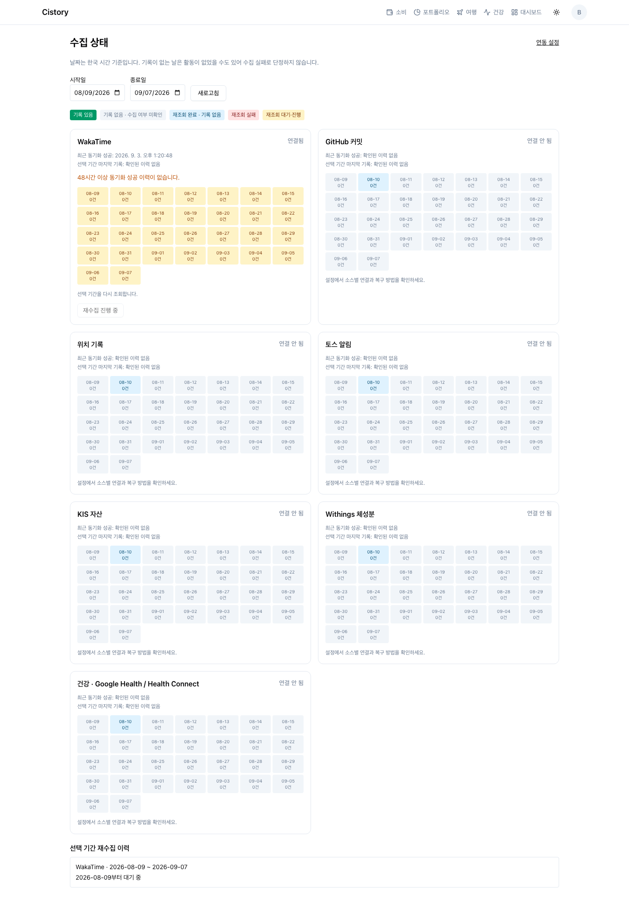
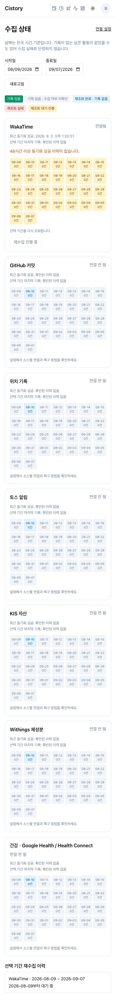

# Service reliability implementation

Scope: audit B1–B10, the audit's technical improvements, and feature 1 (collection status and supported date-range recovery). Work is local on `feat/service-reliability-and-data-status`; no push, PR or production deployment is part of this run. Existing user changes to AGENTS.md are preserved.

## Bug fixes

| Audit | Result | Evidence |
| --- | --- | --- |
| B1 | Health card describes measured days and values; no invented correlation or stable-coding claim. | `health/observation.test.ts`, browser health case |
| B2 | Returns compare dates with snapshots for every selected account; missing accounts are unknown, with excluded dates exposed. | portfolio returns route, coverage and calculation tests |
| B3 | Returns load the settlement lookback before the first comparison snapshot. | pre-period settlement regression |
| B4 | Summary service requires the owner; every manual/cron caller is scoped. Atomic claims and completion fences prevent duplicate external work and stale results. | route/unit tests and PostgreSQL summary claims |
| B5 | Dashboard keeps life records and selected date when there are no commits. | dashboard unit/browser tests |
| B6 | Session/date keyed Query cache, bounded staleness, focus/poll revalidation and cancellation replace the permanent transaction Map; failed dates show errors. | timeline hook/component tests |
| B7 | Account deletion transaction removes application rows, every session, OAuth credentials and auth user. Database session validation revokes other devices. | unit/API tests and real PostgreSQL cascade/rollback tests |
| B8 | User trip edits change autoDetected to false; later detection preserves manual context. | trip edit/redetection tests |
| B9 | Sync HTTP failures, health fetch errors and empty measurements are visibly distinct; retry is available. | dashboard/health/body tests and browser failure→retry flows |
| B10 | Privacy page discloses personal-record processing by Anthropic and corrects credential-storage wording. | source review of AI prompt paths |

Returns still use the existing weekend-only T+2 approximation and inferred external flows; the service does not claim broker-statement accounting or a Korean exchange holiday calendar. AI transmission disclosure was corrected; a new per-source AI consent product was outside the selected feature.

## Technical changes

- Node 24.20.0 across local version file, engines, type definitions and Docker; Yarn stays 4.5.0. Explicit version guard in dev/build.
- Next 16.3.4, Better Auth 1.7.3, Anthropic SDK 0.124.0, Undici 8.10.2, Recharts 3.10.1; compatible transitive patches and immutable lockfile. Installed TSX replaces unpinned runtime downloads.
- TanStack Query is introduced for transactions, health auxiliaries and collection status. Authentication boundaries remount the cache. Existing SSE and map state retain their own lifecycles.
- Summary statistics use one bounded-result JOIN/GROUP BY. The 10k-commit fixture benchmark is in `2026-09-07-summary-query.md`; this is not a production latency claim.
- Jenkins adds isolated Chromium regressions before deployment, preserves migration-before-deploy order and separate web/cron containers, and retains standalone instrumentation repair.
- README now covers actual setup, checks, Jenkins, source limitations and backup/restore.
- Simplification review: no reuse change needed; one quality improvement (source recovery availability lookup), two efficiency improvements (parallel independent status reads; skip empty Withings transaction). Date-state branching was extracted without changing labels. No safety checks were removed.

Compatible audit updates leave three moderate tooling-chain entries under current stable Drizzle Kit (two deprecations and esbuild's unused development server advisory). No high/critical findings remain; nothing is hidden or force-overridden. See `2026-09-07-dependencies-and-browser.md`.

## Collection status and recovery

`/data-status`, linked from Settings, shows seven sources, connection/reauth state, confirmed sync/receipt times, last record within the selected period and daily evidence. Missing records remain unknown unless a completed recovery confirmed an empty day. New push receipt timestamps are recorded after successful OwnTracks/Toss persistence; no old receipt times are invented.

WakaTime, Withings and Google Health scalar metrics support KST ranges of at most 31 days through today. Other sources have recovery instructions specific to the data actually available. Phone-only Health Connect, sleep/workout sessions, missing source notifications and historical KIS valuation snapshots are not fabricated.

Migration `0042_data_recovery.sql` adds `data_recovery_jobs` and `source_sync_states`, both cascade-owned by users. PostgreSQL serializes enqueue per owner/source and claims with SKIP LOCKED plus expiring UUID leases. The cron worker processes bounded daily units; heartbeats, durable cursor and fenced completion survive restarts. Normal failure and exhausted crash retries invalidate affected overview snapshots/narratives, clear exhausted counters and fence old computations.

Health recovery stages a complete metric-day response before replacing that source's rows and rebuilding its daily summary in one transaction. It shares a user lock with compaction to avoid combining old buckets and recovered raw points. Repeat recovery/compaction is tested for stable mean and sample count, with unrelated source identities retained. Existing storage does not distinguish phone and cloud records using the exact same source identifier; the identifier is the replacement boundary. Empty provider results do not erase history whose ownership cannot be established.

## Validation record

- `yarn test`: 1,065 tests, 125 files passed.
- `yarn test:integration`: 25 tests, 7 files passed, including actual Better Auth compatibility.
- `yarn typecheck`: passed. `yarn lint`: no errors; 91 warnings and 1 informational diagnostic remain in the repository (initial baseline: 95 warnings and 1 info).
- `yarn install --immutable`: passed. Audit: only the three documented moderate tooling entries.
- Docker `runner`: production Turbopack build and standalone instrumentation repair passed; HTTP `/api/health` returned 200 with cron disabled; separate cron created its readiness marker.
- Docker `migrator`: installed TSX applied migrations to disposable PostgreSQL successfully; repeat invocation was idempotent.
- Docker `tester`: all 1,065 unit tests passed on Node 24 Alpine.
- Docker `integration-tester`: migrations and all 25 PostgreSQL tests passed on Linux (the final newly added auth test was mounted read-only into the already-built test image).
- Docker Debian `browser-tester`: optimized webpack build and all 10 desktop/mobile cases passed (47.4s). A follow-up 2-case production run additionally rendered all seven collection sources and the full 30-day grid, passing without horizontal overflow.
- Better Auth uses actual signed cookies against a manually defined legacy 1.6 schema. See `../better-auth-1.7-compatibility.md`, including the read-only production duplicate-identity check required before rollout.
- `git diff --check`: passed.

Jenkins itself was not triggered. Its Docker build/run paths were reproduced locally on Linux ARM64; the Jenkins host's architecture, production DB drift and live GitHub OAuth are not claimed verified.

Screenshots are synthetic fixtures, not personal records:

 Browser artifacts stay in gitignored `test-results`; tests use an isolated app, fake API responses and no production secrets. PostgreSQL fixtures use disposable DB/private schemas and are cleaned after tests. Live provider OAuth, provider credentials, and an actual remote Jenkins deployment are not exercised.
